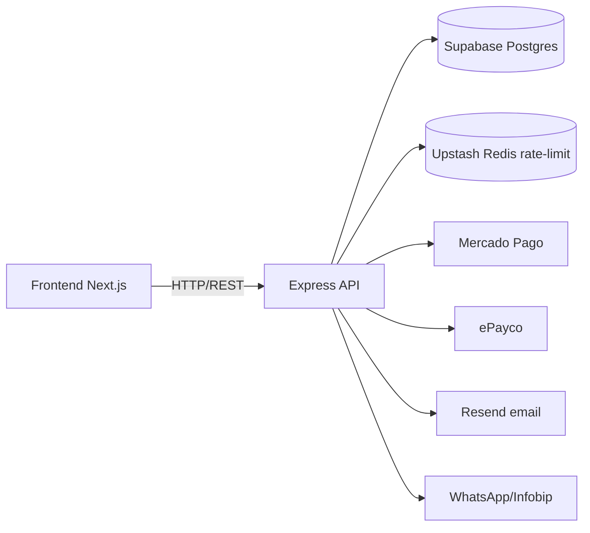

# Backend — API de Entradas

API REST de la plataforma La U. Express 5 + TypeScript, arquitectura por módulos con capas `routes → controller → service → repository`.

## Stack

| Área | Tecnología |
|------|-----------|
| Runtime | Node.js + Express 5 + TypeScript |
| ORM | Prisma 7 (adapter `pg`) |
| DB | Supabase Postgres (pooler `DATABASE_URL` puerto 6543 / `DIRECT_URL` directo 5432) |
| Pagos | Mercado Pago + ePayco (webhooks de confirmación) |
| Messaging | Resend (email) + WhatsApp (Infobip) No implemetado aún |
| Rate limit | Upstash Redis (`@upstash/ratelimit`) |
| Validación | Zod |
| Tests | Vitest + Supertest |
| Logs | Pino |
| QR | `qrcode` + JWT (`QR_JWT_SECRET`) |

## Requisitos

- Node.js ≥ 20
- pnpm (`npm i -g pnpm`)
- Proyecto Supabase (Postgres) y cuentas de Mercado Pago / ePayco / Resend / Upstash

## Instalación

```bash
cd backend
pnpm install
cp .env.example .env   # llenar credenciales
pnpm prisma:generate
```

## Comandos de Desarrollo

| Comando | Descripción |
|---------|-------------|
| `pnpm dev` | Servidor dev con `tsx watch` → http://localhost:3001 |
| `pnpm test` | Ejecutar tests (Vitest) |
| `pnpm test:watch` | Tests en modo watch |
| `pnpm lint` | ESLint |
| `pnpm lint:fix` | ESLint + fix |
| `pnpm format` | Prettier (escribe) |
| `pnpm build` | `prisma generate` + `tsc` + copia plantillas de email a `dist/` |
| `pnpm start` | Servidor de producción desde `dist/server.js` |
| `pnpm copy-templates` | Copia `src/modules/messaging/templates/**/*.html` → `dist/modules` |

## Prisma

El cliente Prisma usa **pooler** (`DATABASE_URL`) en runtime y **conexión directa** (`DIRECT_URL`) para migraciones y seed (definido en `prisma.config.ts`).

| Comando | Descripción |
|---------|-------------|
| `pnpm prisma:generate` | Regenera el cliente Prisma |
| `pnpm prisma migrate dev` | Crea/aplica migración en dev (genera + diff) |
| `pnpm prisma migrate dev --name <nombre>` | Crea migración con nombre |
| `pnpm prisma migrate deploy` | Aplica migraciones pendientes en **producción** |
| `pnpm prisma migrate status` | Estado de migraciones vs BD |
| `pnpm prisma db push` | Sincroniza schema sin migraciones (solo proto/dev) |
| `pnpm prisma db seed` | Ejecuta el seed (`tsx prisma/seed.ts`) |
| `pnpm prisma studio` | Explorador visual de datos |

> Scripts de seed configurados en `package.json` → `"prisma": { "seed": "tsx prisma/seed.ts" }` y en `prisma.config.ts`.

### Flujo típico de migración

```bash
# Cambiar schema.prisma → luego:
pnpm prisma migrate dev --name describe_cambio   # dev: crea migración y la aplica
# Subir migración al repo, en CI/producción:
pnpm prisma migrate deploy                       # aplica las pendientes
pnpm prisma generate                             # cliente actualizado en deploy
```

> En Supabase la migración debe apuntar a `DIRECT_URL` (conexión directa, puerto 5432) y el runtime al pooler (`DATABASE_URL`, puerto 6543).

## Variables de Entorno Clave

| Variable | Uso |
|----------|-----|
| `DATABASE_URL` | Pooler Postgres (runtime) |
| `DIRECT_URL` | Conexión directa (migraciones/seed) |
| `SUPABASE_URL` / `SUPABASE_SERVICE_ROLE_KEY` | Supabase Auth + servicio |
| `QR_JWT_SECRET` / `CONFIRMATION_JWT_SECRET` | Firmado de tokens QR y confirmación |
| `MERCADOPAGO_*` / `EPAYCO_*` | Credenciales de pasarelas de pago |
| `RESEND_API_KEY` / `EMAIL_FROM` | Email transaccional |
| `UPSTASH_REDIS_REST_URL` / `UPSTASH_REDIS_REST_TOKEN` | Rate limit |

## Módulos

Cada módulo bajo `src/modules/<nombre>/` tiene su propio `README.md` con rutas, errores, auth y arquitectura:

`auth` · `users` · `me` · `admins` · `tickets` · `payments` · `donaciones` · `confirmations` · `checkin` · `messaging` · `analytics` · `audit`

## Arquitectura


