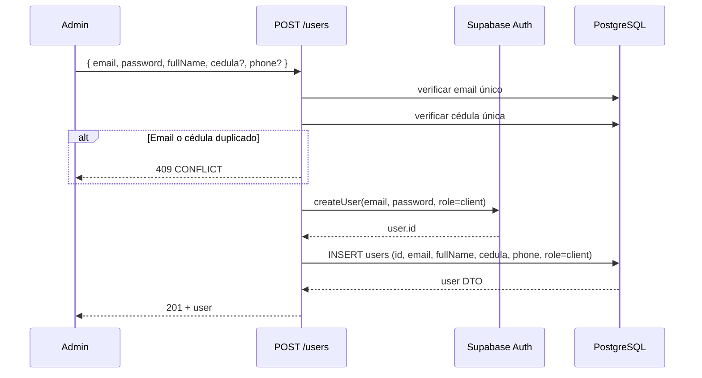
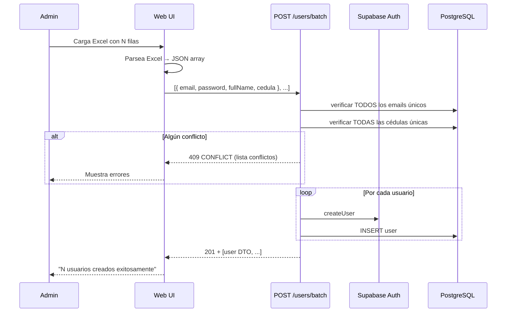
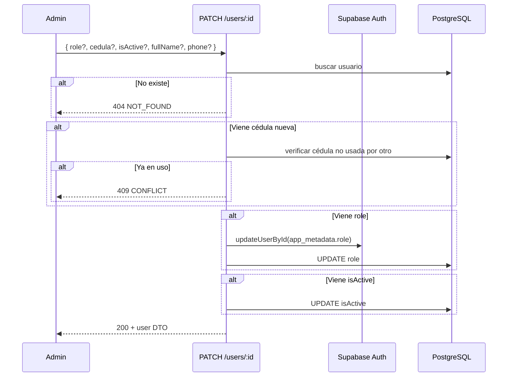

# Módulo Admin — Gestión de Usuarios

Solo rol `admin` (Prisma enum) puede acceder.

## Rutas

| Método | Ruta | Descripción |
|--------|------|-------------|
| GET | `/api/admin/me` | Admin actual desde JWT |
| GET | `/api/admin/users?page=&limit=&search=` | Listar usuarios paginados |
| POST | `/api/admin/users` | Crear 1 cliente (Auth + Prisma) |
| POST | `/api/admin/users/batch` | Crear N clientes desde JSON (máx 50) |
| PATCH | `/api/admin/users/:id` | Modificar datos, cédula, rol, bloqueo |
| GET | `/api/admin/surveys/onboarding` | Listar encuestas onboarding |

## Códigos de Error

| Código | Status | Causa |
|--------|--------|-------|
| `VALIDATION_ERROR` | 422 | Datos inválidos |
| `CONFLICT` | 409 | Email o cédula ya existen |
| `NOT_FOUND` | 404 | Usuario no existe |
| `AUTH_ERROR` | 502 | Error en Supabase Auth |
| `FORBIDDEN` | 403 | Rol no es `admin` |

## Reglas

- Roles asignables: `admin`, `checker`, `client`. `super_admin` prohibido.
- Cédula única en toda la DB. Reasignación permite si otro usuario no la usa.
- `isActive: false` bloquea usuario.

## Flujos

### Crear cliente individual

### Carga masiva desde Excel (batch)

### Modificar usuario (rol / cédula / bloqueo)

