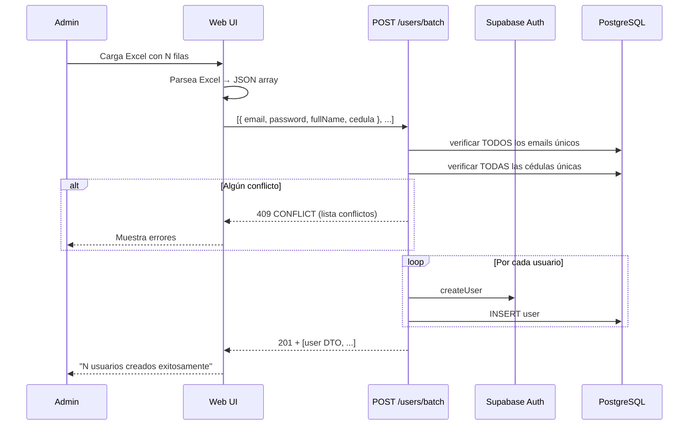
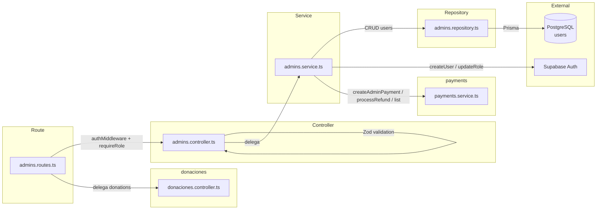

# Módulo Admin — Gestión de Usuarios y Pagos

Solo rol `admin` (Prisma enum) puede acceder.

## Estructura del Módulo

| Archivo | Capa | Responsabilidad |
|---------|------|----------------|
| `admins.routes.ts` | Route | Define endpoints, aplica middlewares de autenticación y rol |
| `admins.controller.ts` | Controller | Valida input (Zod), orquesta servicios, formatea respuesta HTTP |
| `admins.service.ts` | Service | Lógica de negocio: usuarios (CRUD, batch, roles) y pagos admin |
| `admins.repository.ts` | Repository | Consultas Prisma sobre tabla `users` |
| `admins.validators.ts` | Validator | Schemas Zod para cada endpoint |
| `admins.types.ts` | Types | Tipos compartidos (`AdminRole`, `AdminProfile`) |

### Capa Service

| Método | Input | Output | Dependencias |
|--------|-------|--------|-------------|
| `listUsers` | page, limit, search? | `{ data, total, page, limit }` | `adminsRepo.findAll`, `adminsRepo.countAll` |
| `createUser` | data (email, password, fullName, ...) | user DTO | Supabase Auth + `adminsRepo.upsert` |
| `batchCreateUsers` | dataArray[] | user DTO[] | `checkUserExists`, `createUser` (loop) |
| `updateUser` | id, data (role?, cedula?, etc.) | user DTO | `adminsRepo.findById`, `adminsRepo.findByCedula`, Supabase Auth, `adminsRepo.update` |
| `updateRole` | id, role | user DTO | `adminsRepo.findById`, `adminsRepo.updateRole`, Supabase Auth |
| `checkUserExists` | userId | boolean | `adminsRepo.findById` |
| `createAdminPayment` | userId, provider, tickets, adminId | `{ paymentId, ticketIds }` | `paymentsService.createAdminPayment` |

### Capa Repository (Prisma — tabla `users`)

| Método | Query | Uso |
|--------|-------|-----|
| `findAll` | `findMany` con skip/take + search | Listar usuarios paginados |
| `countAll` | `count` con search | Total para paginación |
| `findById` | `findUnique` por id | Validar existencia |
| `findByCedula` | `findUnique` por cedula | Validar unicidad de cédula |
| `findConflicts` | `findMany` con OR emails/cedulas | Batch: detectar duplicados |
| `updateRole` | `update` con role | Cambiar rol |
| `upsert` | `upsert` por id | Crear usuario (fallback update) |
| `update` | `update` con datos parciales | Modificar campos |

## Rutas: Usuarios

| Método | Ruta | Descripción |
|--------|------|-------------|
| GET | `/api/admin/me` | Admin actual desde JWT |
| GET | `/api/admin/users?page=&limit=&search=` | Listar usuarios paginados |
| POST | `/api/admin/users` | Crear 1 cliente (Auth + Prisma) |
| POST | `/api/admin/users/batch` | Crear N clientes desde JSON (máx 50) |
| PATCH | `/api/admin/users/:id` | Modificar datos, cédula, rol, bloqueo |

## Rutas: Pagos

| Método | Ruta | Descripción |
|--------|------|-------------|
| GET | `/api/admin/payments?page=&limit=&status=&dateFrom=&dateTo=&search=` | Listar pagos paginados con filtros |
| GET | `/api/admin/payments/:id` | Detalle del pago + usuario + tickets |
| POST | `/api/admin/payments/:id/refund` | Reembolsar pago completo (borra tickets, restaura stock) |
| POST | `/api/admin/payments/manual` | Pago manual/gift + tickets en transacción |

## Rutas: Donaciones (delegadas)

| Método | Ruta | Descripción |
|--------|------|-------------|
| GET | `/api/admin/donations?page=&limit=&state=&account=&search=` | Listar donaciones paginadas (handler de `donaciones.controller`) |

## Autenticación

Todas las rutas requieren JWT. Rol por ruta:

| Ruta | Rol |
|------|-----|
| GET `/api/admin/me` | cualquiera autenticado |
| GET `/api/admin/users`, `/api/admin/payments`, `/api/admin/donations` | `admin`, `super_admin` |
| POST/PATCH `/api/admin/users*`, `/api/admin/payments/*`, `/api/admin/payments/manual` | `admin` |

## Códigos de Error

| Código | Status | Causa |
|--------|--------|-------|
| `VALIDATION_ERROR` | 422 | Datos inválidos |
| `CONFLICT` | 409 | Email o cédula ya existen |
| `NOT_FOUND` | 404 | Usuario/pago no existe |
| `AUTH_ERROR` | 502 | Error en Supabase Auth |
| `FORBIDDEN` | 403 | Rol no es `admin` |
| `INVALID_PAYMENT_STATUS` | 409 | Reembolso sobre pago no completado |
| `SOLD_OUT` | 409 | Sin inventario para venta manual |

## Reglas

- Roles asignables: `admin`, `checker`, `client`. `super_admin` prohibido.
- Cédula única en toda la DB. Reasignación permite si otro usuario no la usa.
- `isActive: false` bloquea usuario.

## Flujos

### Carga masiva desde Excel (batch)

```mermaid
sequenceDiagram
    participant Admin
    participant Frontend as Web UI
    participant API as POST /users/batch
    participant Auth as Supabase Auth
    participant DB as PostgreSQL

    Admin->>Frontend: Carga Excel con N filas
    Frontend->>Frontend: Parsea Excel → JSON array
    Frontend->>API: [{ email, password, fullName, cedula }, ...]
    API->>DB: verificar TODOS los emails únicos
    API->>DB: verificar TODAS las cédulas únicas
    alt Algún conflicto
        API-->>Frontend: 409 CONFLICT (lista conflictos)
        Frontend-->>Admin: Muestra errores
    end
    loop Por cada usuario
        API->>Auth: createUser
        API->>DB: INSERT user
    end
    API-->>Frontend: 201 + [user DTO, ...]
    Frontend-->>Admin: "N usuarios creados exitosamente"
```

**Pagos (refund y manual):** flujos transaccionales en `payments` module — ver `payments/README.md`.

## Arquitectura del Módulo

```mermaid
graph LR
    subgraph Route
        R[admins.routes.ts]
    end
    subgraph Controller
        C[admins.controller.ts]
    end
    subgraph Service
        S[admins.service.ts]
    end
    subgraph Repository
        Repo[admins.repository.ts]
    end
    subgraph payments
        PS[payments.service.ts]
    end
    subgraph donaciones
        DC[donaciones.controller.ts]
    end
    subgraph External
        Auth[Supabase Auth]
        DB[(PostgreSQL<br/>users)]
    end

    R -->|authMiddleware + requireRole| C
    R -->|delega donations| DC
    C -->|Zod validation| C
    C -->|delega| S
    S -->|CRUD users| Repo
    S -->|createUser / updateRole| Auth
    S -->|createAdminPayment / processRefund / list| PS
    Repo -->|Prisma| DB
```
