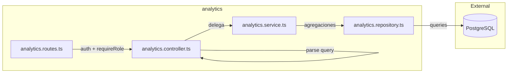

# Módulo Analytics — Métricas y Reportes

Consultas de solo lectura para el dashboard administrativo. Sin lógica transaccional — agrega datos de ventas, tickets, usuarios, reembolsos, donaciones y check-in.

## Rutas

Montadas bajo `/api/admin/analytics`. **Auth:** `authMiddleware` + `requireRole('super_admin', 'admin')` + rate limit aplicados a nivel de router.

Filtro común opcional en query: `from` / `to` (fechas ISO).

| Método | Ruta | Descripción |
|--------|------|-------------|
| GET | `/sales/weekly` | Ventas diarias (tickets pagados) |
| GET | `/revenue/cumulative` | Ingresos acumulados por día |
| GET | `/sales/by-ticket-type` | Ventas diarias agrupadas por tipo de entrada (stacked) |
| GET | `/sales/summary` | Resumen: ingresos, tickets vendidos, ticket promedio, % capacidad |
| GET | `/funnel` | Embudo: reservados → pagados → confirmados → usados (con % del primer paso) |
| GET | `/tickets/status-breakdown` | Conteo por estado de ticket (pre-compra vs post-compra) |
| GET | `/tickets/no-shows` | No shows: % no asistió sobre confirmados |
| GET | `/users/weekly-signups` | Registros de usuarios por día |
| GET | `/users/by-role` | Conteo de usuarios por rol |
| GET | `/users/login-activity` | Usuarios activos por día |
| GET | `/refunds/weekly` | Reembolsos por día (conteo + monto) |
| GET | `/refunds/rate` | Tasa de reembolso (%) |
| GET | `/donations/weekly` | Donaciones por día (conteo + monto, filtro por `state`) |
| GET | `/donations/summary` | Resumen de donaciones por cuenta |
| GET | `/checkin/progress` | Progreso check-in: usados vs confirmados (%) |
| GET | `/weekly-report` | Reporte semanal (param `week=YYYY-Www`) |

## Códigos de Error

| Código | Status | Causa |
|--------|--------|-------|
| `VALIDATION_ERROR` | 400 | Query inválido (rango de fechas mal formado, `week` inválido) |
| `NOT_FOUND` | 404 | `weekly-report` con semana fuera de rango |
| `UNAUTHORIZED` | 401 | Sin JWT |
| `FORBIDDEN` | 403 | Rol no es `admin`/`super_admin` |

## Arquitectura

