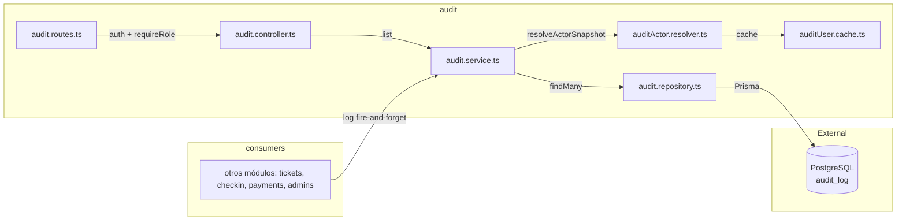

# Módulo Audit — Registro de Auditoría

Persistencia de eventos de auditoría (acciones de admin/checker sobre entidades). API de solo lectura; la escritura es fire-and-forget: un fallo de auditoría **no** revierte la mutación de negocio.

## Rutas

Montadas bajo `/api/audit-log`. **Auth:** `authMiddleware` + `requireRole('super_admin')` + rate limit a nivel de router.

| Método | Ruta | Descripción |
|--------|------|-------------|
| GET | `/` | Listar eventos con filtros `since`, `entityType`, `limit` (paginado por cursor: `nextCursor`, `hasMore`) |

## Códigos de Error

| Código | Status | Causa |
|--------|--------|-------|
| `VALIDATION_ERROR` | 400 | Query inválido |
| `UNAUTHORIZED` | 401 | Sin JWT |
| `FORBIDDEN` | 403 | Rol no es `super_admin` |

## Escritura (uso interno)

`auditService.log(...)` resuelve el snapshot del actor (rol, nombre, cédula) y persiste. Envuelto en try/catch: si falla se loguea y continúa. Lo invocan otros módulos tras transacciones de negocio (CRUD ticket types, check-in, pagos, usuarios).

## Arquitectura

