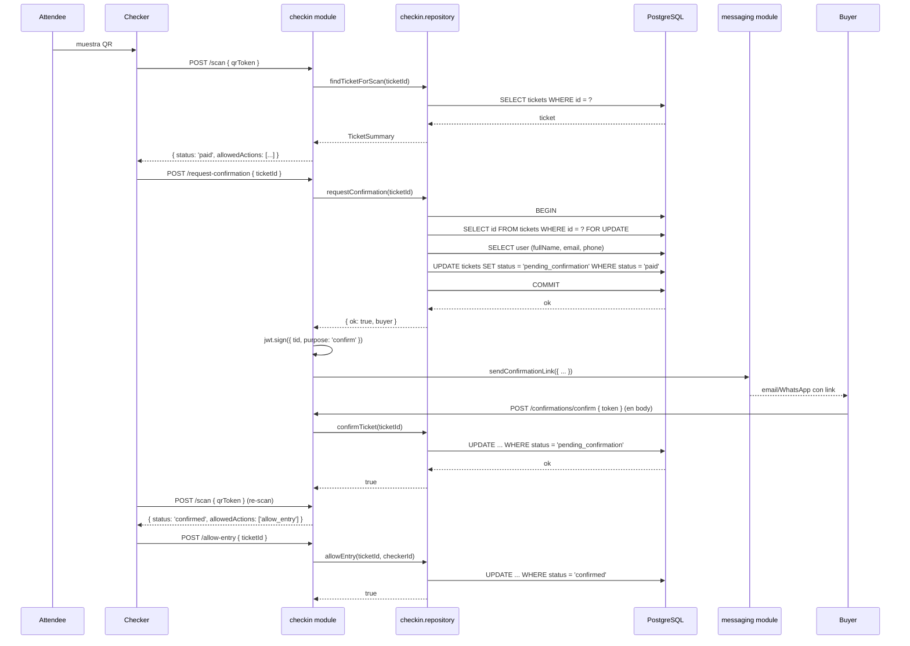
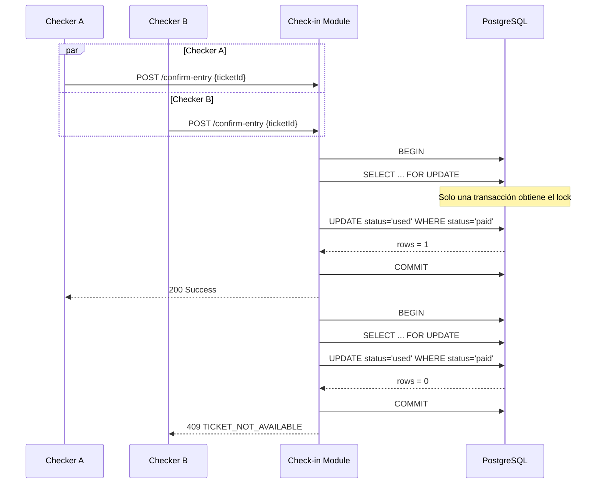
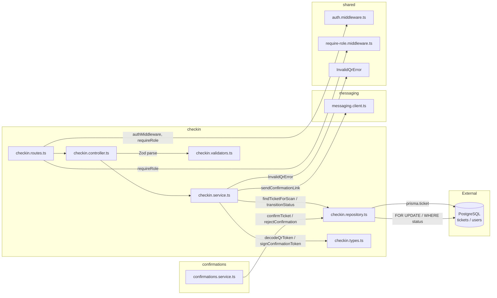

# Módulo Checkin — Validación de QR y Control de Ingreso

Validación de QR + registro de ingreso de asistentes. Maneja el caso donde el portador del QR no es el titular (confirmación remota).
Cada ticket se procesa individualmente — un comprador con N tickets = N escaneos independientes.

## Estructura del Módulo

| Archivo | Capa | Responsabilidad |
|---------|------|----------------|
| `checkin.routes.ts` | Route | `Router()` con `authMiddleware` + `requireRole('checker', 'admin')` aplicado a nivel de router |
| `checkin.controller.ts` | Controller | 4 handlers: `scan`, `confirmEntry`, `requestConfirmationHandler`, `allowEntryHandler` |
| `checkin.service.ts` | Service | 4 métodos: `scanTicket`, `confirmEntryDirect`, `requestConfirmation`, `allowEntry` |
| `checkin.repository.ts` | Repository | Transiciones con `$transaction` + `FOR UPDATE` + `WHERE status = X` (idempotencia) |
| `checkin.validators.ts` | Validator | Schemas Zod: `scanSchema`, `ticketActionSchema` |
| `checkin.types.ts` | Types | `CheckerAction`, `TicketStatus`, `TicketSummary`, `getAllowedActions()` |
| `index.ts` | Barrel | Re-exporta `checkinRouter` |

### Capa Service

| Método | Input | Output | Dependencias |
|--------|-------|--------|-------------|
| `scanTicket` | qrToken | `TicketSummary` con `allowedActions` calculadas | `jwt.verify` (QR_JWT_SECRET) + `checkinRepo.findTicketForScan` + `getAllowedActions` |
| `confirmEntryDirect` | ticketId, checkerId | void o `ConflictError` | `checkinRepo.confirmEntryDirect` |
| `requestConfirmation` | ticketId, checkerId | void o `NotFoundError`/`ConflictError` | `checkinRepo.requestConfirmation` (tx con `FOR UPDATE`) + `jwt.sign` (CONFIRMATION_JWT_SECRET) + `messagingClient.sendConfirmationLink` |
| `allowEntry` | ticketId, checkerId | void o `ConflictError` | `checkinRepo.allowEntry` |

### Capa Repository

| Método | Transacción | Locks | Transición |
|--------|-------------|-------|-----------|
| `findTicketForScan` | ninguna (read-only) | — | — |
| `confirmEntryDirect` | `$transaction` | `WHERE status = 'paid'` | `paid → used` (setea `checkedInAt` + `checkedInBy`) |
| `requestConfirmation` | `$transaction` | `FOR UPDATE` + `WHERE status = 'paid'` | `paid → pending_confirmation` (setea `confirmationRequestedAt`) |
| `allowEntry` | `$transaction` | `WHERE status = 'confirmed'` | `confirmed → used` |
| `confirmTicket` | `$transaction` | `WHERE status = 'pending_confirmation'` | `pending_confirmation → confirmed` (usado por módulo `confirmations`) |
| `rejectConfirmation` | `$transaction` | `findUnique` + `WHERE status = 'pending_confirmation'` | `pending_confirmation → paid` (con check explícito para distinguir éxito de error) |

**Regla de idempotencia**: cada transición usa `updateMany WHERE status = Z`. Si otro checker ya cambió el estado, `result.count === 0` y el controller mapea a `TICKET_NOT_AVAILABLE` (409).

## Rutas

Montadas bajo `/internal/checkin` en `app.ts`. Requieren JWT + rol `checker` o `admin`.

| Método | Ruta | Descripción |
|--------|------|-------------|
| POST | `/internal/checkin/scan` | Decodifica QR, devuelve ticket + acciones permitidas (read-only, idempotente) |
| POST | `/internal/checkin/confirm-entry` | `paid → used` (titular presente, ingreso directo) |
| POST | `/internal/checkin/request-confirmation` | `paid → pending_confirmation` + envía link de confirmación al comprador |
| POST | `/internal/checkin/allow-entry` | `confirmed → used` (comprador ya autorizó remotamente) |

## Códigos de Error

| Código | Status | Capa | Causa |
|--------|--------|------|-------|
| `VALIDATION_ERROR` | 422 | Controller | Body inválido (Zod) |
| `INVALID_QR` | 400 | Service | QR JWT manipulado, expirado o sin `tid` |
| `NOT_FOUND` | 404 | Service | Ticket no existe |
| `TICKET_NOT_AVAILABLE` | 409 | Service | Estado no permite la acción (incluye carrera entre dos checkers) |
| `UNAUTHORIZED` | 401 | Middleware | Sin JWT de sesión |
| `FORBIDDEN` | 403 | Middleware | Rol no es `checker` o `admin` |

## Diagrama de Secuencia — Confirmación Remota

## Diagrama de Secuencia — Carrera entre Checkers

## Arquitectura del Módulo

## Dependencias entre Módulos

- `checkin → messaging` (interfaz pública `messagingClient.sendConfirmationLink`)
- `confirmations → checkin.repository` (reutiliza `confirmTicket`, `rejectConfirmation` — no duplica lógica de transición)
- `checkin.repository → confirmations` — **ninguna** (la dependencia va solo en un sentido)

## Fuera de Alcance

- Confirmar/rechazar por parte del comprador → módulo `confirmations`
- Generación del QR → módulo `tickets`
