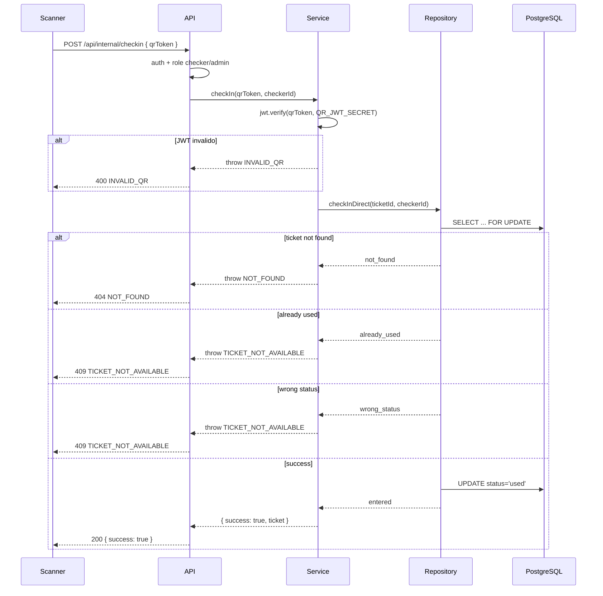

# Modulo Checkin — Ingreso por QR

Validacion y registro de entrada de tickets via QR JWT. Endpoint bajo `/api/internal/`.

## Rutas

| Metodo | Ruta | Descripcion | Auth |
|--------|------|-------------|------|
| POST | `/api/internal/checkin` | Validar QR y marcar ingreso | JWT checker/admin |

## Errores

| Codigo | Status | Causa |
|--------|--------|-------|
| `VALIDATION_ERROR` | 422 | QR token vacio |
| `INVALID_QR` | 400 | JWT invalido o manipulado |
| `TICKET_NOT_AVAILABLE` | 409 | Ticket ya usado / estado incorrecto |
| `NOT_FOUND` | 404 | Ticket no existe |
| `UNAUTHORIZED` | 401 | JWT faltante |
| `FORBIDDEN` | 403 | Rol no es checker/admin |

## Request

```json
{
  "qrToken": "eyJhbGciOiJIUzI1NiIs..."
}
```

## Response 200

```json
{
  "success": true,
  "ticket": { "id": "uuid" }
}
```

## Response 409

```json
{
  "error": {
    "code": "TICKET_NOT_AVAILABLE",
    "message": "Ticket is already checked in"
  }
}
```

## Flujo: Check-in Directo



## Funciones del Repositorio

| Funcion | Transicion | Uso |
|---------|-----------|-----|
| `checkInDirect` | paid → used | Titular coincide con comprador |
| `requestConfirmation` | paid → pending_confirmation | Titular NO coincide |
| `confirmTicket` | pending_confirmation → confirmed | Comprador autoriza |
| `rejectConfirmation` | pending_confirmation → paid | Rechazo o timeout |
| `allowEntry` | confirmed → used | Staff permite ingreso |
| `findByPendingConfirmationAndConfirmed` | - | Dashboard del checker |
