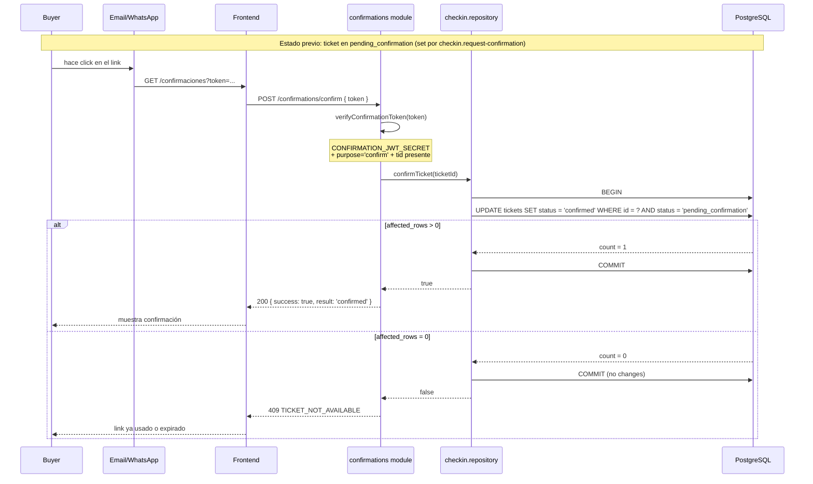
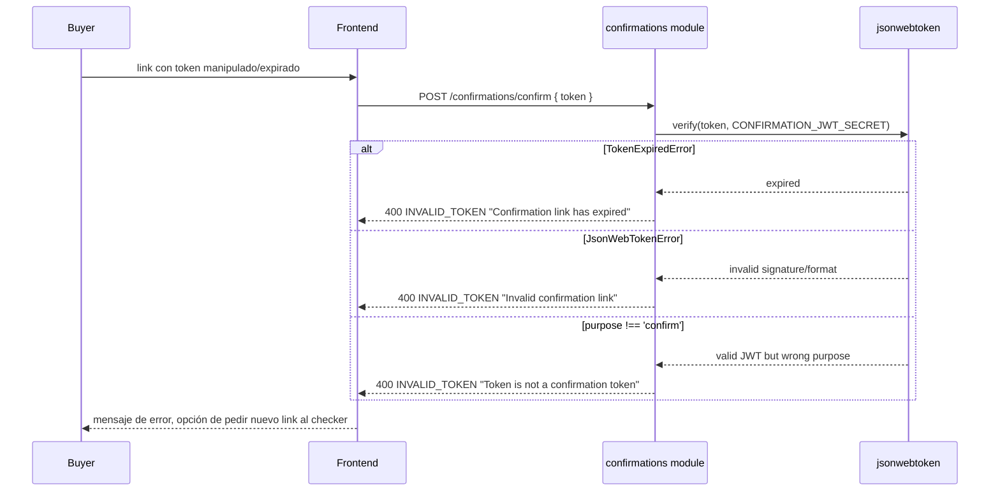
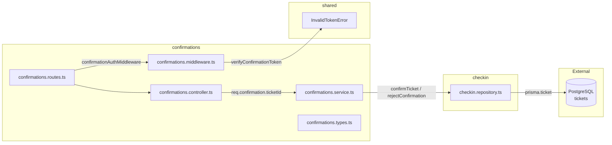

# Módulo Confirmations — Confirmación Remota del Comprador

Permite al comprador (titular real del ticket) confirmar o rechazar de forma remota que autoriza el ingreso de la persona que porta físicamente el QR.
Sin sesión — autenticado únicamente por el token que llega en el link de email/WhatsApp.

## Estructura del Módulo

| Archivo | Capa | Responsabilidad |
|---------|------|----------------|
| `confirmations.routes.ts` | Route | `Router()` con `confirmationAuthMiddleware` aplicado a cada ruta (no session auth) |
| `confirmations.controller.ts` | Controller | 2 handlers: `confirm`, `reject` |
| `confirmations.service.ts` | Service | 2 métodos: `confirm`, `reject` — delegan a `checkin.repository` |
| `confirmations.middleware.ts` | Middleware | `verifyConfirmationToken` + `confirmationAuthMiddleware` (verifica `CONFIRMATION_JWT_SECRET`, decodifica `tid`) |
| `confirmations.types.ts` | Types | `ConfirmationResult`, `ConfirmationTokenPayload` |

**Sin `repository` propio** — el módulo reutiliza las funciones de transición de estado de `checkin.repository` (`confirmTicket`, `rejectConfirmation`). La dependencia va solo en un sentido: `confirmations → checkin.repository`, nunca al revés.

### Capa Service

| Método | Input | Output | Dependencias |
|--------|-------|--------|-------------|
| `confirm` | ticketId | `'confirmed'` o `ConflictError` | `checkinRepo.confirmTicket` |
| `reject` | ticketId | `'rejected'` o `ConflictError` | `checkinRepo.rejectConfirmation` |

### Capa Middleware

| Función | Propósito | Error |
|---------|-----------|-------|
| `verifyConfirmationToken` | Verifica JWT con `CONFIRMATION_JWT_SECRET`, valida `purpose === 'confirm'`, extrae `tid` | `InvalidTokenError(400)` |
| `confirmationAuthMiddleware` | Lee `req.body.token`, llama a `verifyConfirmationToken`, adjunta `req.confirmation.ticketId` | `InvalidTokenError(400)` |

**Tipos de error JWT distinguidos** (mensajes diferentes para el frontend):
- `TokenExpiredError` → `"Confirmation link has expired"`
- `JsonWebTokenError` → `"Invalid confirmation link"`
- `purpose !== 'confirm'` o sin `tid` → `"Token is not a confirmation token"`

## Mecanismo de Auth: JWT de Un Solo Propósito

- **Emisor**: `checkin.request-confirmation` (no este módulo — solo lo consume)
- **Payload**: `{ tid: ticketId, purpose: 'confirm' }`
- **Firma**: `CONFIRMATION_JWT_SECRET` — distinto de `QR_JWT_SECRET` (un QR filtrado no sirve como link de confirmación)
- **TTL**: 30 minutos (`CONFIRMATION_TOKEN_TTL`, configurable)
- **"Un solo uso"**: no se valida con blacklist de tokens. Se valida verificando que el ticket siga en `pending_confirmation` al momento de procesar. Si ya no lo está, la respuesta es `TICKET_NOT_AVAILABLE` (409), no un error de token.

## Rutas

Montadas bajo `/confirmations` en `app.ts`. **Sin autenticación de sesión** — autenticadas por el JWT de confirmación en el body.

| Método | Ruta | Descripción |
|--------|------|-------------|
| POST | `/confirmations/confirm` | Comprador confirma ingreso (`pending_confirmation → confirmed`) |
| POST | `/confirmations/reject` | Comprador rechaza ingreso (`pending_confirmation → paid`) |

**Token en el body, no en la URL**: el link del email/WhatsApp lleva el token en query string (`?token=...`) para que la página de confirmación del frontend pueda recibirlo. La página lo extrae y lo envía en el POST body para que no quede en logs de acceso del API.

## Códigos de Error

| Código | Status | Capa | Causa |
|--------|--------|------|-------|
| `VALIDATION_ERROR` | 422 | Middleware | Token vacío en el body |
| `INVALID_TOKEN` | 400 | Middleware | JWT inválido, manipulado, expirado o sin `purpose: 'confirm'` |
| `TICKET_NOT_AVAILABLE` | 409 | Service | Ticket ya no está en `pending_confirmation` (confirmado, rechazado, expirado por sweep) |
| `NOT_FOUND` | 404 | Repository | Ticket no existe (solo vía repo si el flujo lo expone — el service actual mapea ambos casos a 409) |

## Diagrama de Secuencia — Flujo Completo

## Diagrama de Secuencia — Token Inválido

## Arquitectura del Módulo

## Dependencias entre Módulos

- `confirmations → checkin.repository` (reutiliza funciones de transición de estado)
- `confirmations → messaging` — **ninguna** (el envío del link es responsabilidad de `checkin.request-confirmation`)
- `confirmations → shared` (usa `InvalidTokenError` y `env.CONFIRMATION_JWT_SECRET`)

## Fuera de Alcance

- Envío del mensaje con el link → responsabilidad de `checkin.request-confirmation`
- Persistencia de tokens o lista negra de tokens consumidos — el "un solo uso" se valida contra el estado del ticket
