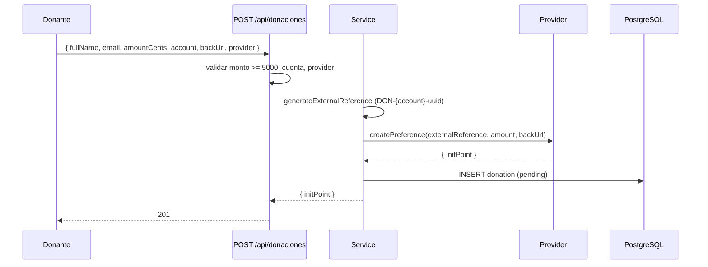
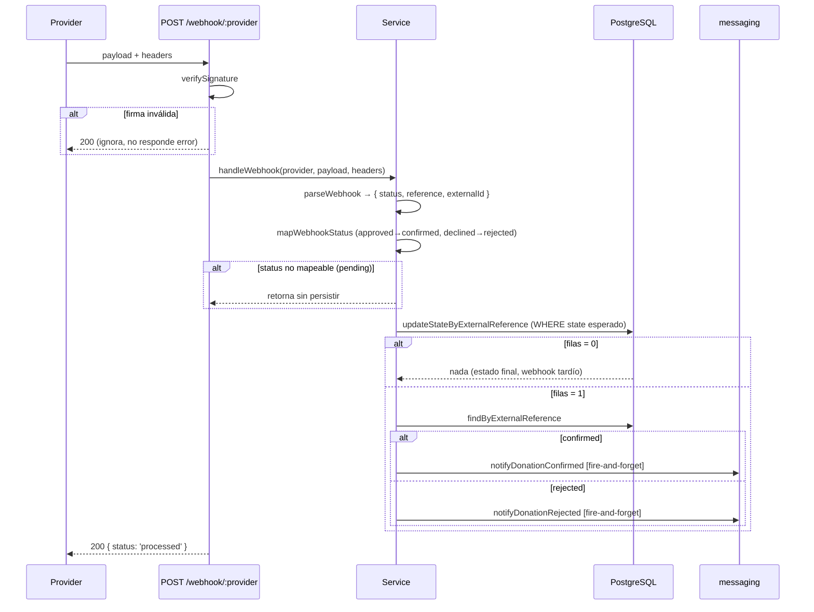
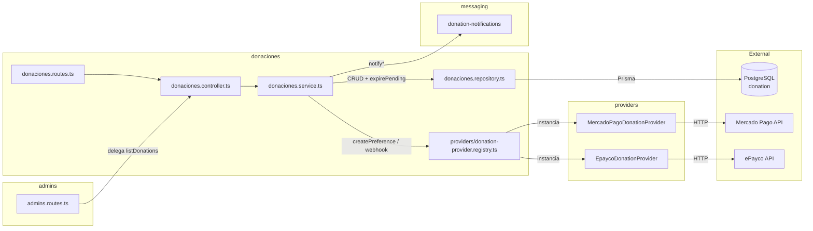

# Módulo Donaciones — Recaudo Solidario

Donaciones puntuales por cuenta (`LA_CONVENCION`, `BARRANQUEROS_UTP`) vía proveedores de pago. Público: crear y consultar estado. Admin: listado paginado.

## Rutas

| Método | Ruta | Auth | Descripción |
|--------|------|------|-------------|
| POST | `/api/donaciones` | Público | Crear donación (mínimo 5000 COP) → devuelve `initPoint` |
| POST | `/api/donaciones/webhook/mercadopago-la-convencion` | Webhook | Notificación MP (La Convención) |
| POST | `/api/donaciones/webhook/mercadopago-barranqueros-utp` | Webhook | Notificación MP (Barranqueros UTP) |
| POST | `/api/donaciones/webhook/epayco-la-convencion` | Webhook | Notificación ePayco (La Convención) |
| POST | `/api/donaciones/webhook/epayco-barranqueros-utp` | Webhook | Notificación ePayco (Barranqueros UTP) |
| GET | `/api/donaciones/:externalReference/status` | Público | Estado de una donación |
| GET | `/api/admin/donations` | admin/super_admin | Listado paginado (filtros `state`, `account`, `search`) — ruta definida en `admins.routes.ts`, manejada por este controller |

Webhooks verificados por firma (`donation-webhook-signature.middleware`) y limitados por rate limit. El body llega crudo para que el proveedor pueda verificar su HMAC.

## Máquina de Estados

`pending → confirmed | rejected | cancelled`

- `pending`: creada, esperando webhook.
- `confirmed`: webhook `approved` (solo si estado previo es `pending`/`rejected`).
- `rejected`: webhook `declined` (solo desde `pending`).
- `cancelled`: sweep cron expira pendientes viejos.

Transiciones idempotentes: `updateMany WHERE state = esperado`. Si el webhook llega tarde sobre un estado final, no actualiza nada (se loguea warning).

## Códigos de Error

| Código | Status | Causa |
|--------|--------|-------|
| `VALIDATION_ERROR` | 422 | Monto < 5000, cuenta/provider inválidos, query de listado inválido |
| `NOT_FOUND` | 404 | `:externalReference` no existe |
| `UNAUTHORIZED` | 401 | Sin JWT (solo listado admin) |
| `FORBIDDEN` | 403 | Rol no es `admin`/`super_admin` (solo listado admin) |

## Flujo: Crear Donación

## Flujo: Webhook de Confirmación

## Arquitectura

