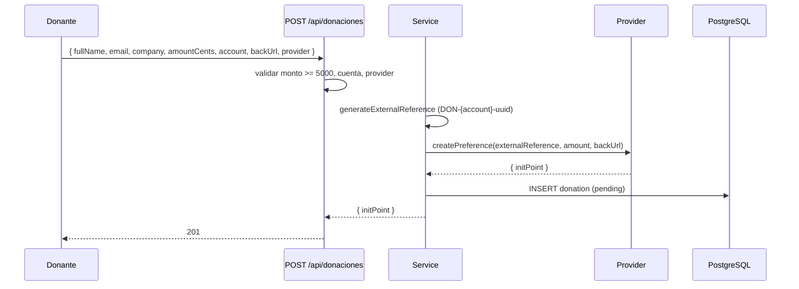
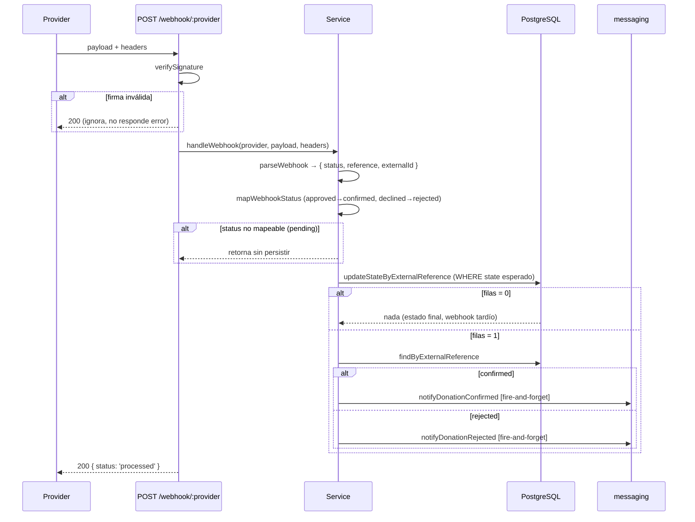
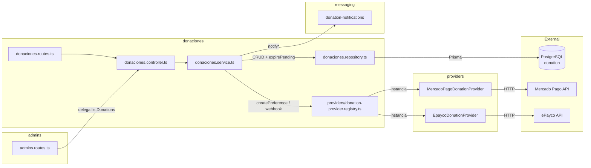

# Módulo Donaciones — Recaudo Solidario

Donaciones puntuales por cuenta (`LA_CONVENCION`, `BARRANQUEROS_UTP`, `VICTIMAS`) vía proveedores de pago. Público: crear y consultar estado. Admin: listado paginado.

Cuentas (`DonationAccount`): `LA_CONVENCION` (La Convención), `BARRANQUEROS_UTP` (Barranqueros UTP), `VICTIMAS` (Víctimas y damnificados — campaña sismos Colombia).

## Rutas

| Método | Ruta | Auth | Descripción |
|--------|------|------|-------------|
| POST | `/api/donaciones` | Público | Crear donación (mínimo 5000 COP) → `{ initPoint, sessionId? }` |
| POST | `/api/donaciones/webhook/mercadopago-la-convencion` | Webhook | Notificación MP (La Convención) |
| POST | `/api/donaciones/webhook/mercadopago-barranqueros-utp` | Webhook | Notificación MP (Barranqueros UTP) |
| POST | `/api/donaciones/webhook/epayco-la-convencion` | Webhook | Notificación ePayco (La Convención) |
| POST | `/api/donaciones/webhook/epayco-barranqueros-utp` | Webhook | Notificación ePayco (Barranqueros UTP) |
| POST | `/api/donaciones/webhook/epayco-victimas` | Webhook | Notificación ePayco (Víctimas y damnificados) |
| GET | `/api/donaciones/:externalReference/status` | Público | Estado de una donación |
| GET | `/api/admin/donations` | admin/super_admin | Listado paginado (filtros `state`, `account`, `search`) — ruta definida en `admins.routes.ts`, manejada por este controller |

Webhooks verificados por firma (`verifyDonationsWebhookSignature`, instalado en `donaciones.routes.ts` antes del controller) y limitados por rate limit (`POLICIES.webhookGlobal`). El body llega crudo (sin `express.json`) para que el proveedor pueda verificar su HMAC.

Provider expuesto en la API pública: `epayco` (default). Los webhooks siguen aceptando `mercadopago-*` y `epayco-*` registrados en `providers/donation-provider.registry.ts`.

## Máquina de Estados

`pending → confirmed | rejected | cancelled`

- `pending`: creada, esperando webhook.
- `confirmed`: webhook `approved` (solo si estado previo es `pending` o `rejected` — permite reintento del proveedor tras un rechazo transitorio).
- `rejected`: webhook `declined` (solo desde `pending`).
- `cancelled`: sweep cron expira pendientes viejos.

Transiciones idempotentes ejecutadas en `$transaction`: se verifica estado actual y se hace `update` solo si la transición es válida. Si el webhook llega tarde sobre un estado final, no actualiza nada (se loguea warning).

## Códigos de Error

| Código | Status | Causa |
|--------|--------|-------|
| `VALIDATION_ERROR` | 422 | Monto < 5000, cuenta/provider inválidos, query de listado inválido |
| `NOT_FOUND` | 404 | `:externalReference` no existe |
| `UNAUTHORIZED` | 401 | Sin JWT (solo listado admin) |
| `FORBIDDEN` | 403 | Rol no es `admin`/`super_admin` (solo listado admin) |

## Body de Creación

```json
{
  "fullName": "string|null",        // optional
  "email":    "string|null",        // optional, email válido
  "company":  "string|null",        // optional, máx 150 chars (donante empresa/razón social)
  "amountCents": 5000,              // entero ≥ 5000
  "account":  "LA_CONVENCION|BARRANQUEROS_UTP|VICTIMAS",
  "backUrl":  "https://...",        // URL de retorno
  "provider": "epayco"              // default
}
```

Respuesta:

```json
{ "initPoint": "https://...", "sessionId": "..." }
```

## Listing Admin — Shape de Fila

```json
{
  "id": "uuid",
  "fullName": "string|null",
  "email": "string|null",
  "company": "string|null",
  "amountCents": 50000,
  "state": "pending|confirmed|rejected|cancelled",
  "account": "LA_CONVENCION|BARRANQUEROS_UTP|VICTIMAS",
  "externalReference": "DON-LA_CONVENCION-<uuid>",
  "paymentId": "string|null",
  "createdAt": "ISO",
  "updatedAt": "ISO"
}
```

## Flujo: Crear Donación



## Flujo: Webhook de Confirmación



## Arquitectura


