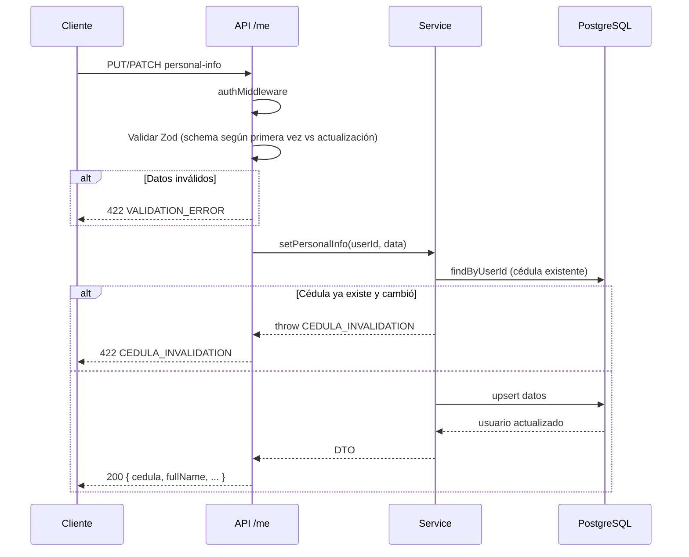
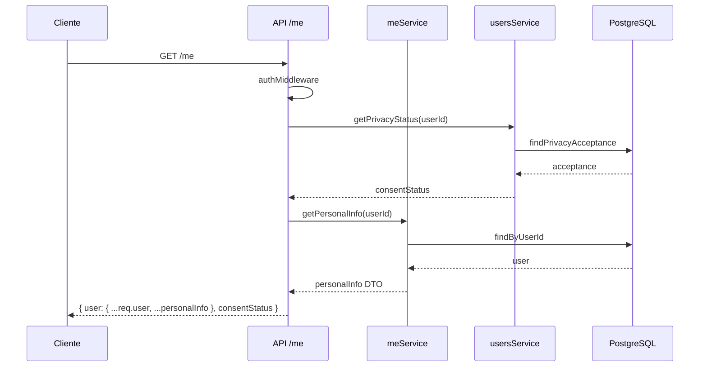

# Módulo Me — Información Personal del Cliente

Endpoints agrupados bajo `/api/me`. Actúa como **agregador usuario autenticado**: expone rutas propias (info personal) y delega a otros módulos (tickets, pagos). Cualquier rol autenticado (client, admin, checker, super_admin) puede acceder a sus propios datos.

## Estructura del Módulo

| Archivo | Capa | Responsabilidad |
|---------|------|----------------|
| `me.routes.ts` | Route | Define endpoints propios + delega tickets/pagos a sus controllers |
| `me.controller.ts` | Controller | Orquesta info personal + privacy status de `usersService` |
| `me.service.ts` | Service | Lógica de upsert de datos personales, validación cédula inmutable |
| `me.repository.ts` | Repository | Consultas Prisma sobre tabla `users` |
| `me.validators.ts` | Validator | Schemas Zod diferenciados: primera vez (cédula requerida) vs actualización (opcional) |

### Capa Service

| Método | Input | Output | Dependencias |
|--------|-------|--------|-------------|
| `getPersonalInfo` | userId | DTO con `{ cedula, fullName, phone, address, dateOfBirth }` | `meRepo.findByUserId` |
| `setPersonalInfo` | userId, data (parcial) | DTO actualizado | `meRepo.findByUserId`, `meRepo.upsert` |

### Capa Repository

| Método | Query | Uso |
|--------|-------|-----|
| `findByUserId` | `findUnique` con `personalInfoSelect` | Obtener datos actuales |
| `upsert` | `update` por id | Guardar/actualizar datos |

## Rutas

| Método | Ruta | Middleware | Descripción | Módulo origen |
|--------|------|-----------|-------------|---------------|
| GET | `/api/me` | `authMiddleware` | Usuario actual + privacy consent | me |
| GET | `/api/me/personal-info` | `authMiddleware` | Obtener info personal (DTO) | me |
| PUT | `/api/me/personal-info` | `authMiddleware` | Crear info personal (cédula requerida) | me |
| PATCH | `/api/me/personal-info` | `authMiddleware` | Actualizar info personal (cédula inmutable) | me |
| GET | `/api/me/tickets` | `authMiddleware` | Listar tickets propios (paginado) | tickets |
| GET | `/api/me/tickets/:id` | `authMiddleware` | Detalle de un ticket propio | tickets |
| GET | `/api/me/payments` | `authMiddleware` | Listar pagos propios (paginado) | payments |

## Códigos de Error

### Propios del módulo

| Código | Status | Causa |
|--------|--------|-------|
| `VALIDATION_ERROR` | 422 | Datos inválidos (Zod) |
| `CEDULA_INVALIDATION` | 422 | Cédula ya fue establecida y no se puede modificar |
| `UNAUTHORIZED` | 401 | JWT faltante o inválido |

### Heredados de tickets/pagos (delegados)

| Código | Status | Módulo | Causa |
|--------|--------|--------|-------|
| `NOT_FOUND` | 404 | tickets | Ticket no existe o no pertenece al usuario |
| `FORBIDDEN` | 403 | tickets | Ticket no pertenece al usuario |
| `NOT_FOUND` | 404 | payments | Pago no encontrado |

## Respuestas

### GET /me — 200
```json
{
  "user": {
    "id": "uuid",
    "email": "user@example.com",
    "role": "client",
    "cedula": "12345678",
    "fullName": "Juan Pérez",
    "phone": "3001234567",
    "address": "Calle 123",
    "dateOfBirth": "1990-01-15"
  },
  "consentStatus": {
    "required": true,
    "acceptedAt": "2025-01-15T10:00:00.000Z",
    "policyVersion": "v1"
  }
}
```

### Personal Info — 200
```json
{
  "cedula": "12345678",
  "fullName": "Juan Pérez",
  "phone": "3001234567",
  "address": "Calle 123",
  "dateOfBirth": "1990-01-15"
}
```
Campos `null` si no se han establecido.

### Error — 422
```json
{
  "error": {
    "code": "CEDULA_INVALIDATION",
    "message": "Cedula already set and cannot be modified"
  }
}
```

## Flujo: SET / PATCH Personal Info



## Flujo: GET /me (agregador)



## Arquitectura del Módulo

```mermaid
graph LR
    subgraph me
        R[me.routes.ts]
        C[me.controller.ts]
        S[me.service.ts]
        Repo[me.repository.ts]
    end
    subgraph users
        US[users.service.ts]
    end
    subgraph tickets
        TC[tickets.controller.ts]
    end
    subgraph payments
        PC[payments.controller.ts]
    end
    subgraph External
        DB[(PostgreSQL<br/>users)]
    end

    R -->|authMiddleware| C
    R -->|delega rutas| TC
    R -->|delega rutas| PC
    C -->|getPrivacyStatus| US
    C -->|getPersonalInfo / setPersonalInfo| S
    S -->|findByUserId / upsert| Repo

