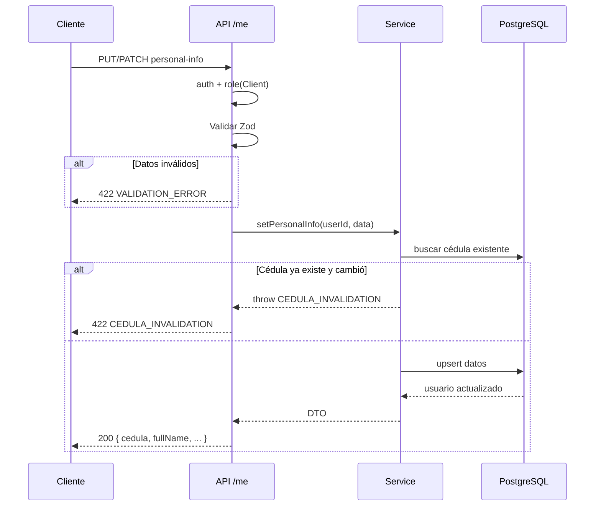

# Módulo Me — Información Personal del Cliente

Endpoints agrupados bajo `/api/me`. Solo rol `client` puede modificar datos personales.

## Rutas

| Método | Ruta | Descripción |
|--------|------|-------------|
| GET | `/api/me` | Usuario actual desde JWT |
| GET | `/api/me/personal-info` | Obtener info personal (DTO completo) |
| PUT | `/api/me/personal-info` | Crear info personal (primera vez, cédula requerida) |
| PATCH | `/api/me/personal-info` | Actualizar info personal (cédula inmutable) |

## Respuestas

### Éxito — 200
```json
{
  "cedula": "12345678",
  "fullName": "Juan Pérez",
  "phone": "3001234567",
  "address": "Calle 123",
  "dateOfBirth": "1990-01-15"
}
```
Campos `null` si no se han establecido.

### Error — 422
```json
{
  "error": {
    "code": "CEDULA_INVALIDATION",
    "message": "Cedula already set and cannot be modified"
  }
}
```

## Códigos de Error

| Código | Status | Causa |
|--------|--------|-------|
| `VALIDATION_ERROR` | 422 | Datos inválidos (Zod) |
| `CEDULA_INVALIDATION` | 422 | Cédula ya fue establecida |
| `UNAUTHORIZED` | 401 | JWT faltante o inválido |
| `FORBIDDEN` | 403 | Rol no es `client` |

## Flujo: SET / PATCH Personal Info


