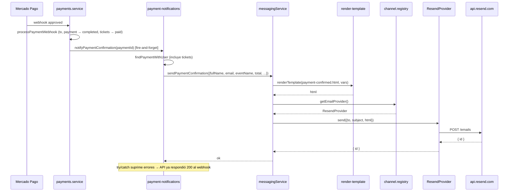
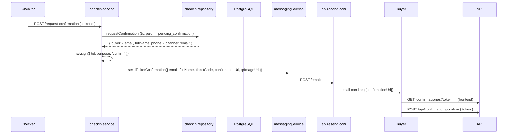
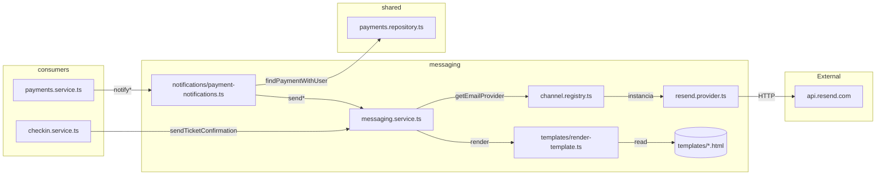

# Módulo Messaging — Emails Transaccionales (Resend)

Envío de emails transaccionales del sistema. **Único canal actualmente**: email vía [Resend](https://resend.com).

## Estructura del Módulo

| Archivo | Capa | Responsabilidad |
|---------|------|----------------|
| `messaging.service.ts` | Service | Punto de entrada público; orquesta render + channel registry. Exporta `send*` para cada tipo de email |
| `notifications/payment-notifications.ts` | Notifier | Helpers `notify*` consumidos por `payments.service.ts` (fire-and-forget) |
| `channels/email-provider.interface.ts` | Adapter interface | `EmailProvider` (subject, html, text) |
| `channels/resend.provider.ts` | Adapter | `ResendProvider` — implementación HTTP contra `api.resend.com` |
| `channels/channel.registry.ts` | Registry | `getEmailProvider()` singleton; lectura única de env en boot |
| `templates/render-template.ts` | Util | Reemplazo de `{{var}}` en HTML, regex-escaped por clave |
| `templates/*.html` | Asset | 6 plantillas: `payment-confirmed`, `payment-failed`, `payment-unfulfillable`, `payment-refunded`, `ticket-confirmed`, `ticket-cancelled` |
| `index.ts` | Barrel | Re-exporta `messagingService` + `notify*` + tipos |

### Capa Service

| Método | Caller | Plantilla | Variables |
|--------|--------|-----------|-----------|
| `sendPaymentConfirmation` | `payments.service` (webhook approved, reclaim) | `payment-confirmed.html` | `fullName`, `eventName`, `ticketCount`, `subtotal`, `total`, `paymentId` |
| `sendPaymentFailed` | `payments.service` (webhook declined) | `payment-failed.html` | `fullName`, `eventName`, `reason` |
| `sendPaymentUnfulfillable` | `payments.service` (reclaim sin cupo) | `payment-unfulfillable.html` | `fullName`, `eventName`, `paymentId` |
| `sendPaymentRefunded` | `payments.service` (admin refund) | `payment-refunded.html` | `fullName`, `eventName`, `reason`, `refundedTicketCount` |
| `sendTicketConfirmation` | `checkin.service` (requestConfirmation, canal email) | `ticket-confirmed.html` | `fullName`, `eventName`, `ticketCode`, `confirmationUrl`, `qrImageUrl`, `expiresInMinutes` |
| `sendTicketCancellation` | `payments.service` (dentro de refund, 1 por ticket) | `ticket-cancelled.html` | `fullName`, `eventName`, `ticketCode` |

### Notifiers (Fire-and-Forget)

`notifications/payment-notifications.ts` expone wrappers `notify*` que:
- Resuelven `user.email` y `user.fullName` con `paymentsRepo.findPaymentWithUser` (incluye `tickets`)
- Llaman al método `send*` del service
- **Swallow errors** (try/catch → console.error). El éxito del pago no depende del email
- No persisten estado de envío (no hay tabla de tracking)

`ResendProvider` hace `POST https://api.resend.com/emails` con headers `Authorization: Bearer ${apiKey}`.

## Variables de Entorno

| Var | Default | Uso |
|-----|---------|-----|
| `RESEND_API_KEY` | — (requerido) | API key de Resend |
| `EMAIL_FROM` | — (requerido) | Remitente verificado, ej `noreply@utp.edu.co` |
| `CONFIRMATION_LINK_BASE_URL` | — | Base para `confirmationUrl` (enlace email → `/confirmaciones?token=...`) |
| `FRONTEND_URL` | — | Base para `qrImageUrl` (link del QR → `/mi-cuenta/entradas/:id`) |

## Rutas

**Ninguna**. El módulo no expone endpoints HTTP. Es consumido por otros módulos (payments, checkin) vía su `messagingService` exportado.

## Códigos de Error

El módulo **no propaga errores** al caller (fire-and-forget). Internamente:

| Origen | Comportamiento |
|--------|---------------|
| `RESEND_API_KEY` no configurada | `getEmailProvider()` tira en boot → server no arranca |
| `EMAIL_FROM` no configurada | Idem |
| Resend devuelve 4xx/5xx | `console.error` + rejected promise que el caller traga |
| Template variable falta | `renderTemplate` deja `{{var}}` literal en el HTML (no falla) |

## Diagrama de Flujo — Notificación de Pago Confirmado

## Diagrama de Flujo — Confirmación Remota de Ticket

## Arquitectura del Módulo

## Dependencias

- `payments → messaging` vía `notify*` helpers
- `checkin → messaging` vía `messagingService.sendTicketConfirmation`
- `messaging → payments.repository` (solo para `findPaymentWithUser` en notifiers)
- Sin dependencias de Express, Supabase, o canales legacy

## Fuera de Alcance

- WhatsApp: stub legacy en `messaging.client.ts`, no integrado. Infobip como adaptador a futuro
- Persistencia de emails enviados (no hay tabla `email_log`)
- Reintentos automáticos (fire-and-forget por ahora)
- Tracking de opens/clicks (no en scope)
- Plantillas dinámicas desde BD (plantillas hardcoded en `templates/`)
