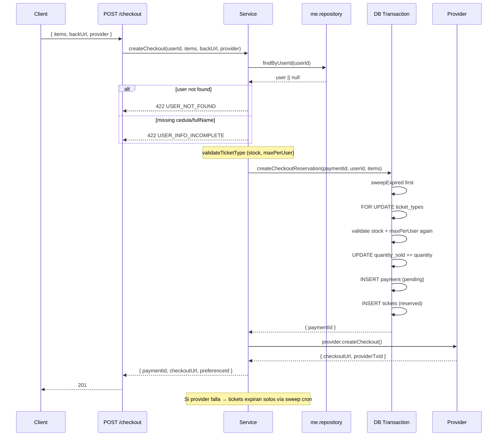
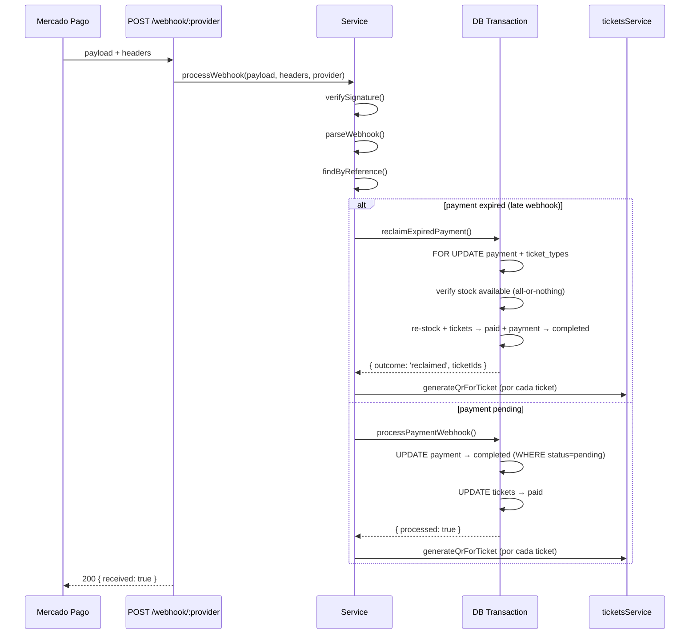
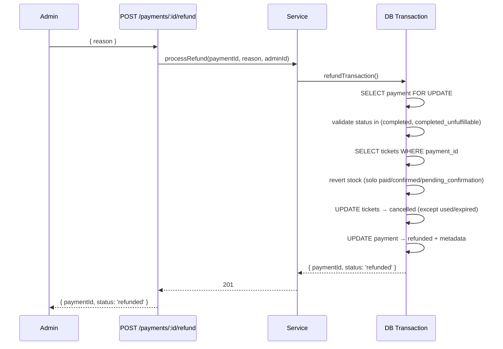
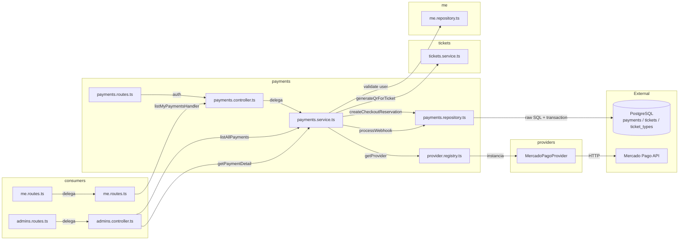

# Payments Module — Multi-Provider Payment Processor

Checkout, webhook, payment status, and admin sale endpoints.
Núcleo transaccional del sistema. Usa **raw SQL** en el repositorio (no Prisma queries) para control fino de transacciones, locks y atomicidad.

## Estructura del Módulo

| Archivo | Capa | Responsabilidad |
|---------|------|----------------|
| `payments.routes.ts` | Route | 3 rutas propias + delegación a admins/me |
| `payments.controller.ts` | Controller | Valida Zod, delega a service |
| `payments.service.ts` | Service | Orquesta validación stock + provider externo + repo transaccional |
| `payments.repository.ts` | Repository | **Raw SQL** + `$transaction` con `FOR UPDATE`, sweep, reclaim, refund |
| `payments.validators.ts` | Validator | Schemas Zod para checkout, status, pagination |
| `payments.types.ts` | Types | `PaymentProvider` interface, `CheckoutInput/Result`, `NormalizedWebhookEvent` |
| `providers/` | Adapter | Implementaciones de `PaymentProvider` por proveedor |

### Capa Service

| Método | Input | Output | Transacciones clave |
|--------|-------|--------|---------------------|
| `createCheckout` | userId, items, backUrl, provider | `{ paymentId, checkoutUrl, preferenceId }` | **User validation → DB→Provider**: verifica usuario existe + completo (cedula/fullName), reserva atómica en DB, llama proveedor externo. Si provider falla, expiran solos vía sweep |
| `processWebhook` | payload, headers, provider | `{ received: true }` | Verifica firma, parsea evento, maneja approved/declined/expired-reclaim |
| `listMyPayments` | userId, page, limit | `{ data, total, page, limit }` | Consulta simple |
| `listAllPayments` | filters | `{ data, total, page, limit }` | Filtros admin (status, fechas, búsqueda) |
| `getPaymentDetail` | paymentId | Payment con user + tickets | Admin |
| `getPaymentStatus` | paymentId, userId, role | Payment + tickets con QR | Owner/admin |
| `createAdminPayment` | userId, provider, tickets, adminId | `{ paymentId, ticketIds }` | **Transacción completa**: bypass stock check, INSERT payment+tickets, genera QR |
| `processRefund` | paymentId, reason, processedById | `{ paymentId, status }` | **Transacción**: FOR UPDATE, revierte stock, marca tickets cancelled, payment refunded |

### Capa Repository — Transacciones

| Método | Transacción | Locks | Paso a paso |
|--------|------------|-------|-------------|
| `createCheckoutReservation` | `$transaction` | `FOR UPDATE` sobre ticket_types | ① Sweep expirados ② Validar stock + maxPerUser + descontar quantity_sold ③ INSERT payment pending ④ INSERT tickets reserved |
| `processPaymentWebhook` | `$transaction` | Optimista (WHERE status check) | ① UPDATE payment → completed ② UPDATE tickets → paid |
| `reclaimExpiredPayment` | `$transaction` | `FOR UPDATE` payment + ticket_types (sorted) | ① Verificar payment sigue expired ② Bloquear ticket_types orden estable ③ Verificar cupo (todo o nada) ④ Re-stock + tickets paid + payment completed |
| `refundTransaction` | `$transaction` | `FOR UPDATE` payment | ① Verificar completed/completed_unfulfillable ② Revertir stock solo tickets paid/confirmed ③ Tickets → cancelled ④ Payment → refunded + metadata refund |
| `createAdminPaymentTransaction` | `$transaction` | `FOR UPDATE` ticket_types | ① Por cada item: validar cupo, descontar stock, INSERT tickets paid ② INSERT payment completed |
| `sweepExpiredReservations` | `$transaction` | `FOR UPDATE` implícito | ① UPDATE tickets expired + revert stock ② UPDATE payments → expired |

### Capa Repository — Consultas

| Método | Query | Uso |
|--------|-------|-----|
| `findByReference` / `findByProviderTxId` | `findUnique` / `findFirst` por id/txId | Webhook lookup |
| `findByIdWithTickets` | `findUnique` + include tickets | Status + detail |
| `findAllByUserId` / `countByUserId` | `findMany` / `count` por userId | Historial cliente |
| `findAllPaymentsFiltered` / `countAllPaymentsFiltered` | `findMany` / `count` con filtros | Listado admin |
| `findPaymentByIdWithUser` | `findUnique` + include user + tickets + ticketType | Detalle admin |
| `markUnfulfillable` | `update` status | Reclaim fallido |

## Routes

### Propias

Montadas en `payments.routes.ts`.

| Method | Path | Auth | Description |
|--------|------|------|-------------|
| POST | `/api/payments/checkout` | JWT user | Crear sesión de pago |
| POST | `/api/payments/webhook/:provider` | Public | Webhook del proveedor |
| GET | `/api/payments/:id/status` | JWT owner/admin | Estado del pago + tickets |

### Delegadas desde admin

Montadas en `admins.routes.ts` bajo `/api/admin/payments`.

| Method | Path | Auth | Description |
|--------|------|------|-------------|
| GET | `/api/admin/payments` | JWT admin | Listar pagos con filtros |
| GET | `/api/admin/payments/:id` | JWT admin | Detalle pago + user + tickets |
| POST | `/api/admin/payments/manual` | JWT admin | Pago manual/gift + tickets |
| POST | `/api/admin/payments/:id/refund` | JWT admin | Reembolso completo |

### Delegadas desde me

Montadas en `me.routes.ts` bajo `/api/me/payments`.

| Method | Path | Auth | Description |
|--------|------|------|-------------|
| GET | `/api/me/payments` | JWT client | Historial de pagos del cliente |

## Errors

| Code | Status | Layer | Cause |
|------|--------|-------|-------|
| `VALIDATION_ERROR` | 422 | Controller | Invalid request data (Zod) |
| `USER_NOT_FOUND` | 422 | Service | User not found (checkout) |
| `USER_INFO_INCOMPLETE` | 422 | Service | User missing cedula/fullName (checkout) |
| `TICKET_TYPE_NOT_FOUND` | 404 | Repo (tx) | Ticket type UUID no existe |
| `TICKET_TYPE_NOT_AVAILABLE` | 400 | Service/Repo | Ticket type disabled |
| `INVALID_QUANTITY` | 422 | Service | Quantity ≤ 0 |
| `MAX_PER_USER_EXCEEDED` | 422 | Repo (tx) | Exceeds maxPerUser (incluye tickets ya adquiridos) |
| `SOLD_OUT` | 409 | Repo (tx) | No inventory en el momento de la reserva |
| `INVALID_SIGNATURE` | 400 | Service | Webhook signature verification failed |
| `NOT_FOUND` | 404 | Service/Repo | Payment/ticket/user not found |
| `FORBIDDEN` | 403 | Service | Not owner/admin |
| `INVALID_PAYMENT_STATUS` | 409 | Repo (tx) | Refund attempted on non-completed payment |

## Diagrama de Transacciones

### Checkout (DB primero, provider después)

### Webhook — Approved

### Refund

## Arquitectura del Módulo

