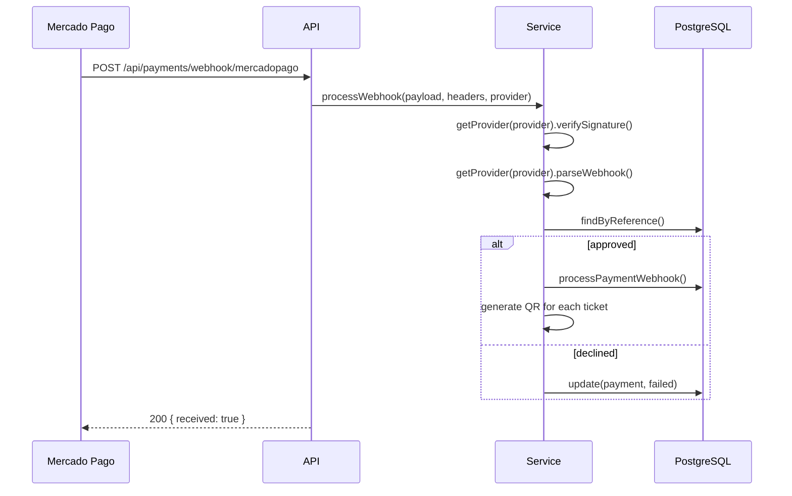
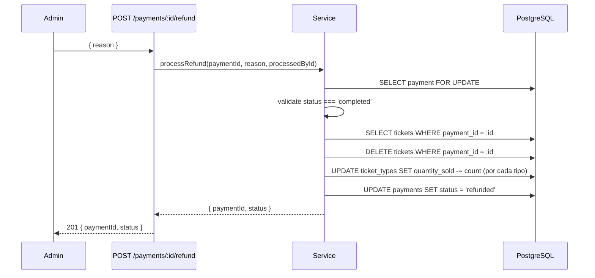
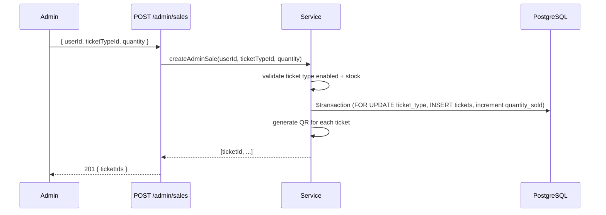

# Payments Module — Multi-Provider Payment Processor

Checkout, webhook, payment status, and admin sale endpoints.

## Routes

| Method | Path | Description | Auth |
|--------|------|-------------|------|
| POST | `/api/checkout` | Create checkout session | JWT user |
| POST | `/api/payments/webhook/:provider` | Provider webhook | Public |
| GET | `/api/payments/:id/status` | Payment status + tickets | JWT owner/admin |
| GET | `/api/admin/payments` | List all payments (admin) | JWT admin |
| GET | `/api/admin/payments/:id` | Payment detail (admin) | JWT admin |
| POST | `/api/admin/sales` | Manual sale creation (admin) | JWT admin |
| POST | `/api/admin/payments/:id/refund` | Full refund (admin) | JWT admin |
| GET | `/api/me/payments` | Client payment history | JWT client |

## Errors

| Code | Status | Cause |
|------|--------|-------|
| `VALIDATION_ERROR` | 422 | Invalid request data (Zod) |
| `TICKET_TYPE_NOT_AVAILABLE` | 400 | Ticket type disabled |
| `MAX_PER_USER_EXCEEDED` | 422 | Exceeds maxPerUser |
| `SOLD_OUT` | 409 | No inventory |
| `INVALID_SIGNATURE` | 400 | Webhook signature invalid |
| `NOT_FOUND` | 404 | Payment/ticket/user not found |
| `FORBIDDEN` | 403 | Not owner/admin |
| `INVALID_PAYMENT_STATUS` | 409 | Refund attempted on non-completed payment |
| `REFUND_EXCEEDS_BALANCE` | 409 | Refund amount > remaining |

## Flow: Checkout


## Flow: Webhook



## Flow: Reembolso (Admin)



## Flow: Venta manual (Admin)



## Structure

```
payments/
  payments.controller.ts   -- Express handlers
  payments.service.ts      -- Business logic
  payments.repository.ts   -- DB access
  payments.validators.ts   -- Zod schemas
  payments.types.ts        -- Types & interfaces
  payments.routes.ts       -- Route definitions
  index.ts                 -- Module exports
  providers/               -- PaymentProvider implementations
```
