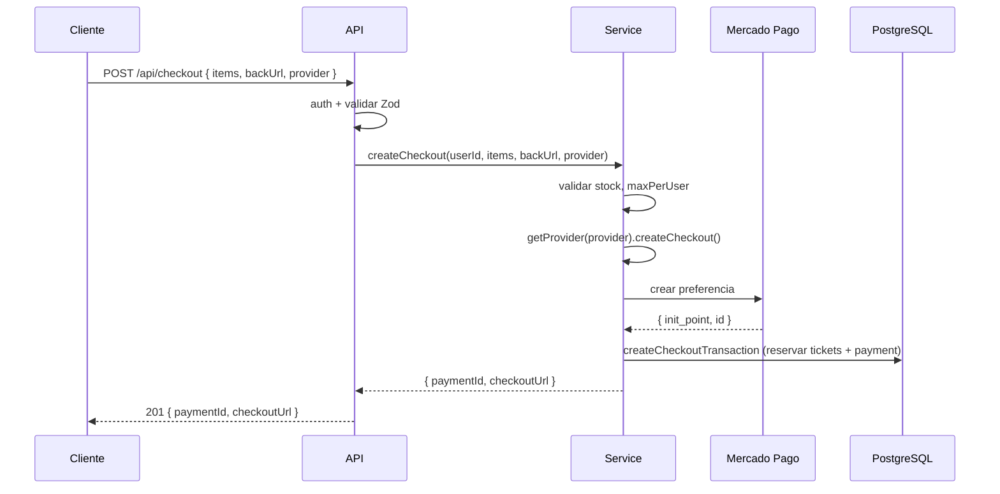
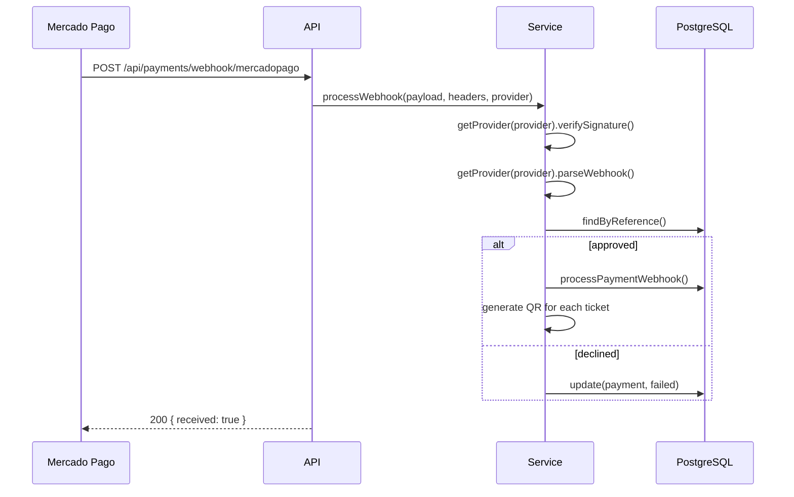

# Modulo Payments — Procesador de Pagos Multi-Provider

Checkout, webhook y consulta de pagos. Endpoints bajo `/api/`.

## Rutas

| Metodo | Ruta | Descripcion | Auth |
|--------|------|-------------|------|
| POST | `/api/checkout` | Crear sesion de pago | JWT usuario |
| POST | `/api/payments/webhook/:provider` | Webhook del provider | Publico |
| GET | `/api/payments/:id/status` | Estado del pago + tickets | JWT owner/admin |

## Errores

| Codigo | Status | Causa |
|--------|--------|-------|
| `VALIDATION_ERROR` | 422 | Datos invalidos (Zod) |
| `TICKET_TYPE_NOT_AVAILABLE` | 400 | Tipo ticket deshabilitado |
| `MAX_PER_USER_EXCEEDED` | 422 | Excede maxPerUser |
| `SOLD_OUT` | 409 | Sin inventario |
| `INVALID_SIGNATURE` | 400 | Firma webhook invalida |
| `NOT_FOUND` | 404 | Payment no encontrado |
| `FORBIDDEN` | 403 | No es owner/admin |

## Flujo: Checkout



## Flujo: Webhook



## Estructura

```
payments/
  routes/            -- definiciones de rutas Express
  controllers/       -- handlers Express
  services/          -- logica de negocio
  repositories/      -- acceso a DB
  validators/        -- esquemas Zod
  types/             -- tipos e interfaces
  providers/         -- implementaciones de PaymentProvider
```
