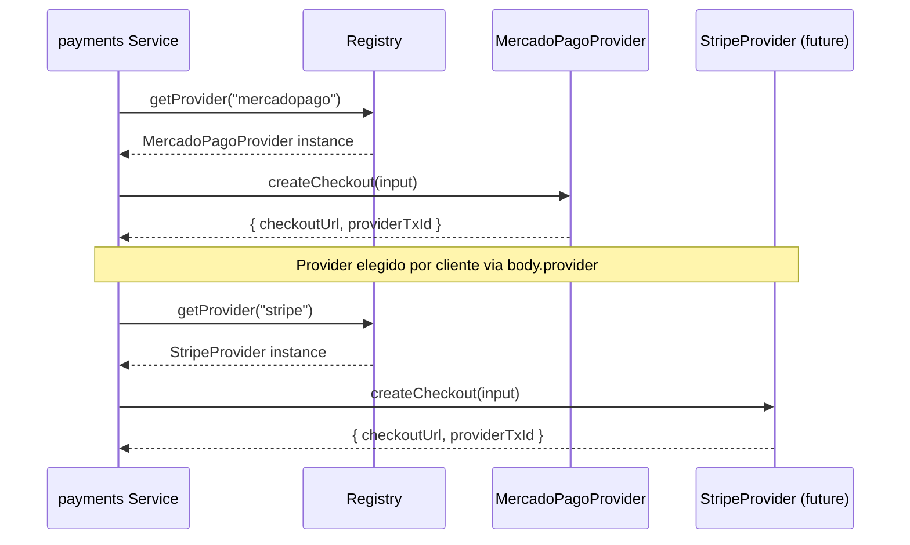

# Providers — Multi-Provider Architecture

`PaymentProvider` interface in `payments.types.ts`. Each provider implements:

- `createCheckout()` — crear sesion de pago externa
- `verifySignature()` — validar firma de webhook
- `parseWebhook()` — parsear notificacion del provider

## Providers Registrados

| Nombre | Clase | Estado |
|--------|-------|--------|
| `mercadopago` | `MercadoPagoProvider` | Activo |

## Registry

`provider.registry.ts` mantiene el mapa de providers. `getProvider(name)` resuelve por nombre normalizado (case-insensitive). Si no existe, lanza error.

## Agregar Nuevo Provider

1. Crear archivo en `providers/` implementando `PaymentProvider`
2. Importar y registrar en `registerKnownProviders()`
3. UI envia `provider: "nombre"` en checkout body

