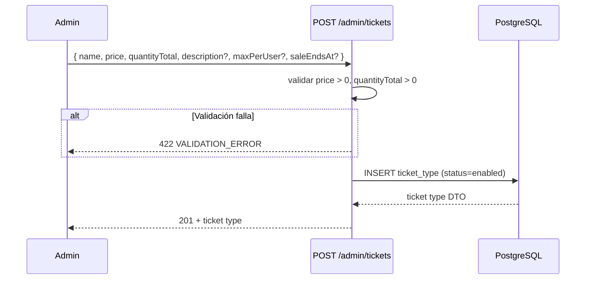
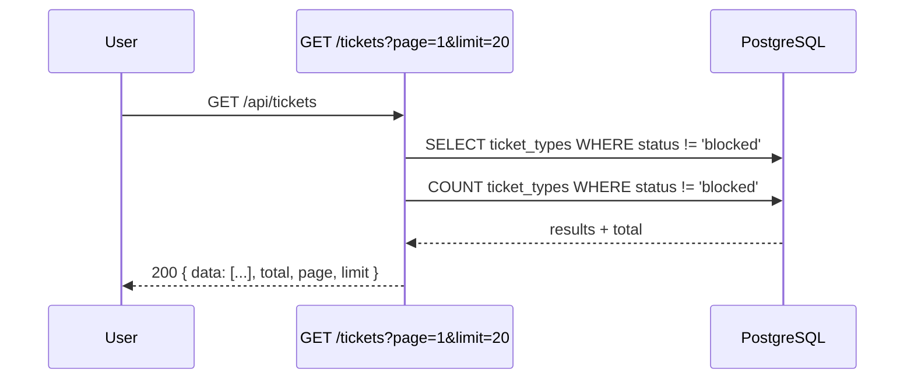
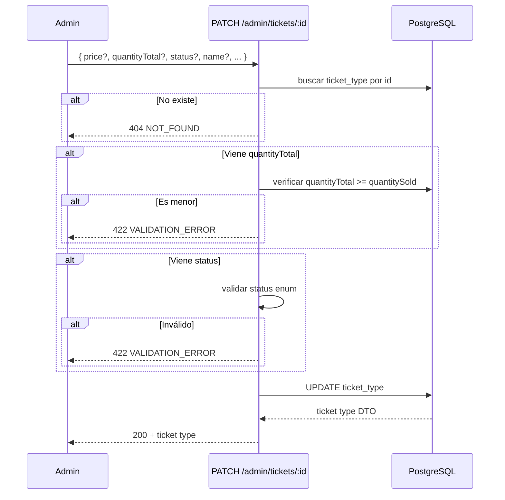

# Módulo Tickets — Gestión de Tipos de Entrada

CRUD de tipos de entrada (ticket types). Público puede listar y ver detalles. Solo admin puede crear, modificar y cambiar estado.

## Rutas Públicas

Montadas bajo `/api/tickets`. Sin autenticación.

| Método | Ruta | Descripción |
|--------|------|-------------|
| GET | `/api/tickets?page=&limit=` | Listar entradas activas/deshabilitadas (excluye bloqueadas) |
| GET | `/api/tickets/:id` | Detalle de entrada por ID (incluye bloqueadas) |

## Rutas Admin

Montadas bajo `/api/admin/tickets`. Requieren JWT + rol `admin`.

| Método | Ruta | Descripción |
|--------|------|-------------|
| GET | `/api/admin/tickets?page=&limit=` | Listar TODAS las entradas (incluye bloqueadas) |
| POST | `/api/admin/tickets` | Crear nuevo tipo de entrada |
| PATCH | `/api/admin/tickets/:id` | Modificar campos + cambiar estado |

## Códigos de Error

| Código | Status | Causa |
|--------|--------|-------|
| `VALIDATION_ERROR` | 422 | Precio ≤ 0, cantidad ≤ 0, cantidad < vendidas, UUID inválido, body vacío, status inválido |
| `NOT_FOUND` | 404 | ID de entrada no existe |
| `FORBIDDEN` | 403 | Rol no es `admin` |
| `UNAUTHORIZED` | 401 | Token JWT faltante o inválido |

## Reglas de Negocio

- `status` puede ser `enabled` (comprable), `disabled` (visible, no comprable), `blocked` (oculta, no comprable)
- Al crear, status por defecto: `enabled`
- `price` y `quantityTotal` deben ser > 0
- Al modificar, `quantityTotal` no puede ser menor a `quantitySold` actual
- Entradas bloqueadas NO aparecen en listado público pero sí por ID individual
- Listado admin muestra todos los estados

## Flujos

### Crear tipo de entrada (admin)

### Listar entradas (público)

### Modificar tipo de entrada + cambiar estado (admin)

