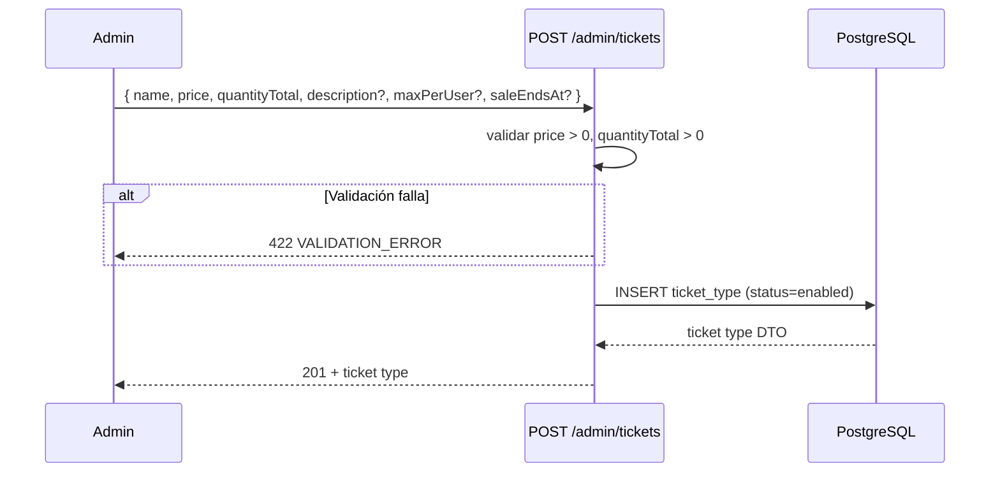
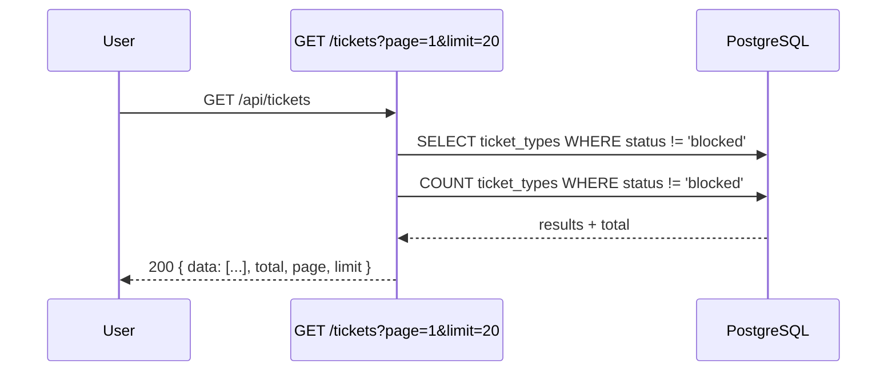
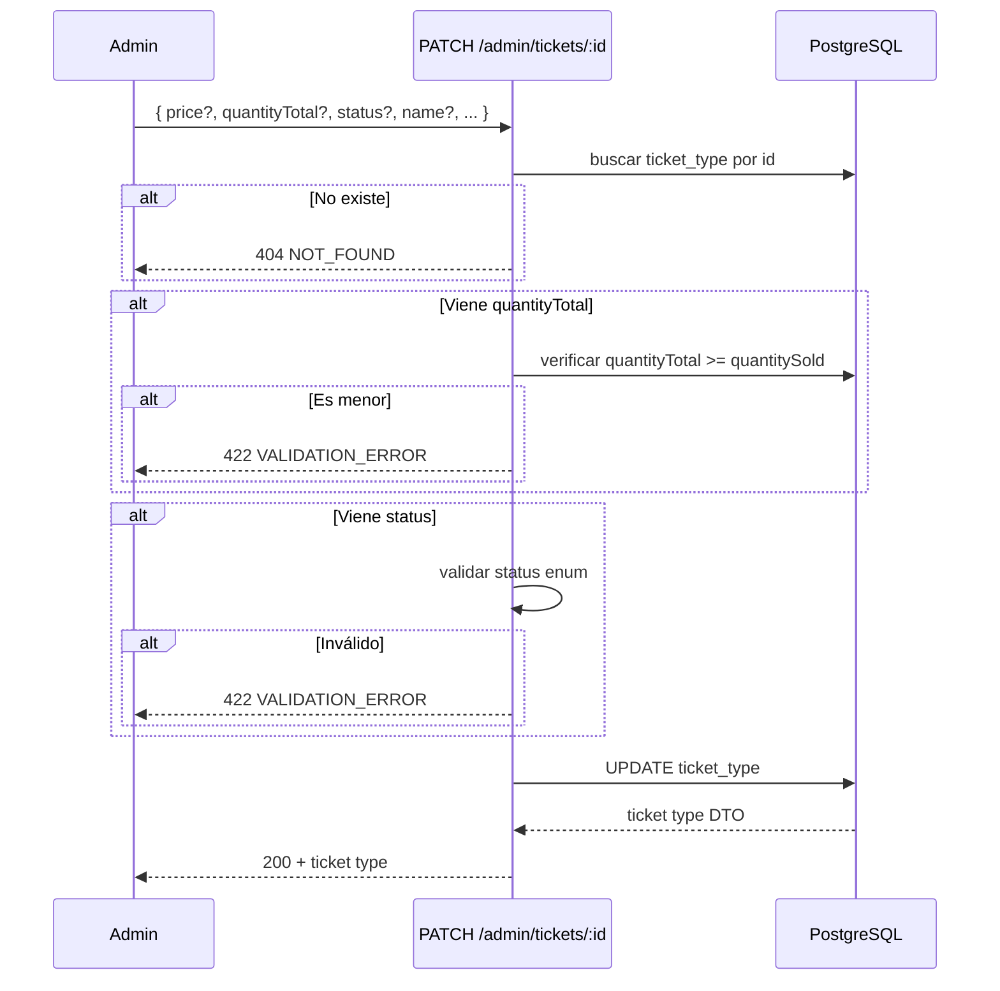
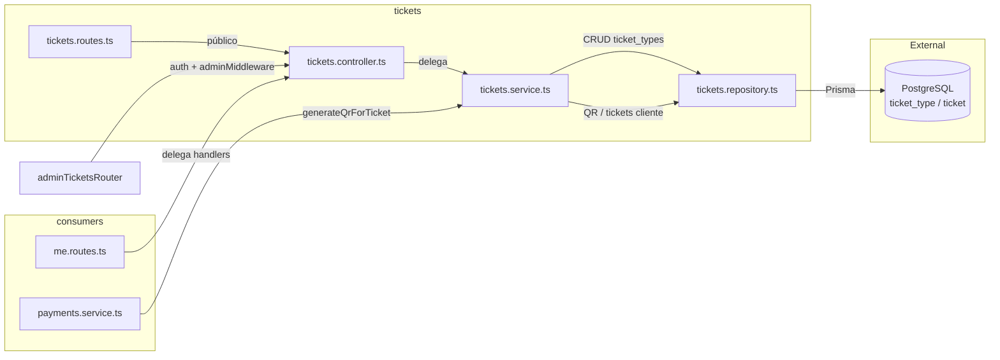

# Módulo Tickets — Gestión de Tipos de Entrada

CRUD de tipos de entrada (ticket types) + consulta de tickets del cliente + generación de QR.
Dos routers: público (`/api/tickets`) y admin (`/api/admin/tickets`).
Sirve como **proveedor de servicio** para `me` (rutas de tickets del cliente) y `payments` (generación de QR).

## Estructura del Módulo

| Archivo | Capa | Responsabilidad |
|---------|------|----------------|
| `tickets.routes.ts` | Route | Dos routers: público (sin auth) y admin (auth + adminMiddleware) |
| `tickets.controller.ts` | Controller | 7 handlers: list, getById, adminList, create, update, listMyTicketsHandler, getMyTicketByIdHandler |
| `tickets.service.ts` | Service | 8 métodos: CRUD ticket types, QR generation, consulta de tickets del cliente |
| `tickets.repository.ts` | Repository | Consultas Prisma sobre tablas `ticket_type` y `ticket` |
| `tickets.validators.ts` | Validator | Schemas Zod: pagination, create, update, params |
| `tickets.types.ts` | Types | `TicketTypeDTO`, `PaginatedResponse`, `CreateTicketInput`, `UpdateTicketInput` |
| `tickets.config.ts` | Config | `DEFAULT_PAGE_LIMIT`, `MAX_PAGE_LIMIT` |

### Capa Service

| Método | Input | Output | Dependencias |
|--------|-------|--------|-------------|
| `listTicketTypes` | page, limit | `{ data, total, page, limit }` | `ticketsRepo.findAllPublic`, `ticketsRepo.countPublic` |
| `getTicketTypeById` | id | `TicketTypeDTO` o throw | `ticketsRepo.findById` |
| `listAllTicketTypes` | page, limit | `{ data, total, page, limit }` | `ticketsRepo.findAllAdmin`, `ticketsRepo.countAll` |
| `createTicketType` | data (name, price, quantityTotal, ...) | `TicketTypeDTO` | `ticketsRepo.create` |
| `updateTicketType` | id, data (parcial) | `TicketTypeDTO` | `ticketsRepo.findById`, `ticketsRepo.update` |
| `generateQrForTicket` | ticketId | qrToken (JWT string) | `jwt.sign` + `ticketsRepo.updateQrToken` |
| `listMyTickets` | userId, page, limit | `{ data, total, page, limit }` | `ticketsRepo.findByUserId`, `ticketsRepo.countByUserId` |
| `getMyTicketById` | ticketId, userId | ticket DTO o throw | `ticketsRepo.findOwnedById` |

### Capa Repository

| Método | Tabla | Query | Uso |
|--------|-------|-------|-----|
| `findAllPublic` | `ticket_type` | `findMany` where status ≠ blocked | Listado público |
| `countPublic` | `ticket_type` | `count` where status ≠ blocked | Total público |
| `findById` | `ticket_type` | `findUnique` por id | Detalle individual |
| `create` | `ticket_type` | `create` | Crear tipo |
| `findAllAdmin` | `ticket_type` | `findMany` sin filtro | Listado admin |
| `countAll` | `ticket_type` | `count` sin filtro | Total admin |
| `update` | `ticket_type` | `update` por id | Modificar tipo |
| `updateQrToken` | `ticket` | `update` por id con qrToken | Guardar QR JWT |
| `findByUserId` | `ticket` | `findMany` por userId (status ≠ expired) | Tickets del cliente |
| `countByUserId` | `ticket` | `count` por userId (status ≠ expired) | Total del cliente |
| `findOwnedById` | `ticket` | `findFirst` por id + userId | Detalle de ticket propio |

## Rutas Públicas

Montadas bajo `/api/tickets`. Sin autenticación.

| Método | Ruta | Descripción |
|--------|------|-------------|
| GET | `/api/tickets?page=&limit=` | Listar entradas activas/deshabilitadas (excluye bloqueadas) |
| GET | `/api/tickets/:id` | Detalle de entrada por ID (incluye bloqueadas) |

## Rutas Admin

Montadas bajo `/api/admin/tickets`. Requieren JWT + rol `admin`.

| Método | Ruta | Descripción |
|--------|------|-------------|
| GET | `/api/admin/tickets?page=&limit=` | Listar TODAS las entradas (incluye bloqueadas) |
| POST | `/api/admin/tickets` | Crear nuevo tipo de entrada |
| PATCH | `/api/admin/tickets/:id` | Modificar campos + cambiar estado |

## Rutas de Cliente (delegadas desde me)

Montadas bajo `/api/me/tickets`. Requieren JWT + rol `client`. Manejadas por `tickets.controller.ts`.

| Método | Ruta | Descripción |
|--------|------|-------------|
| GET | `/api/me/tickets?page=&limit=` | Listar tickets del cliente (excluye expirados) |
| GET | `/api/me/tickets/:id` | Detalle de un ticket propio |

## Códigos de Error

| Código | Status | Causa |
|--------|--------|-------|
| `VALIDATION_ERROR` | 422 | Precio ≤ 0, cantidad ≤ 0, cantidad < vendidas, UUID inválido, body vacío, status inválido |
| `NOT_FOUND` | 404 | ID de entrada no existe |
| `FORBIDDEN` | 403 | Rol no es `admin` |
| `UNAUTHORIZED` | 401 | Token JWT faltante o inválido |

## Reglas de Negocio

- `status` puede ser `enabled` (comprable), `disabled` (visible, no comprable), `blocked` (oculta, no comprable)
- Al crear, status por defecto: `enabled`
- `price` y `quantityTotal` deben ser > 0
- Al modificar, `quantityTotal` no puede ser menor a `quantitySold` actual
- Entradas bloqueadas NO aparecen en listado público pero sí por ID individual
- Listado admin muestra todos los estados
- Tickets expirados (`expired`) no aparecen en listado del cliente

## Consumidores Externos

| Consumer | Método usado | Propósito |
|----------|-------------|-----------|
| `payments.service.ts` | `ticketsService.generateQrForTicket` | Generar QR tras pago exitoso o reclaim |
| `me.routes.ts` | `ticketsController.listMyTicketsHandler` | Delegación de ruta `/api/me/tickets` |
| `me.routes.ts` | `ticketsController.getMyTicketByIdHandler` | Delegación de ruta `/api/me/tickets/:id` |

## Flujos

### Crear tipo de entrada (admin)

### Listar entradas (público)

### Modificar tipo de entrada + cambiar estado (admin)

## Arquitectura del Módulo

