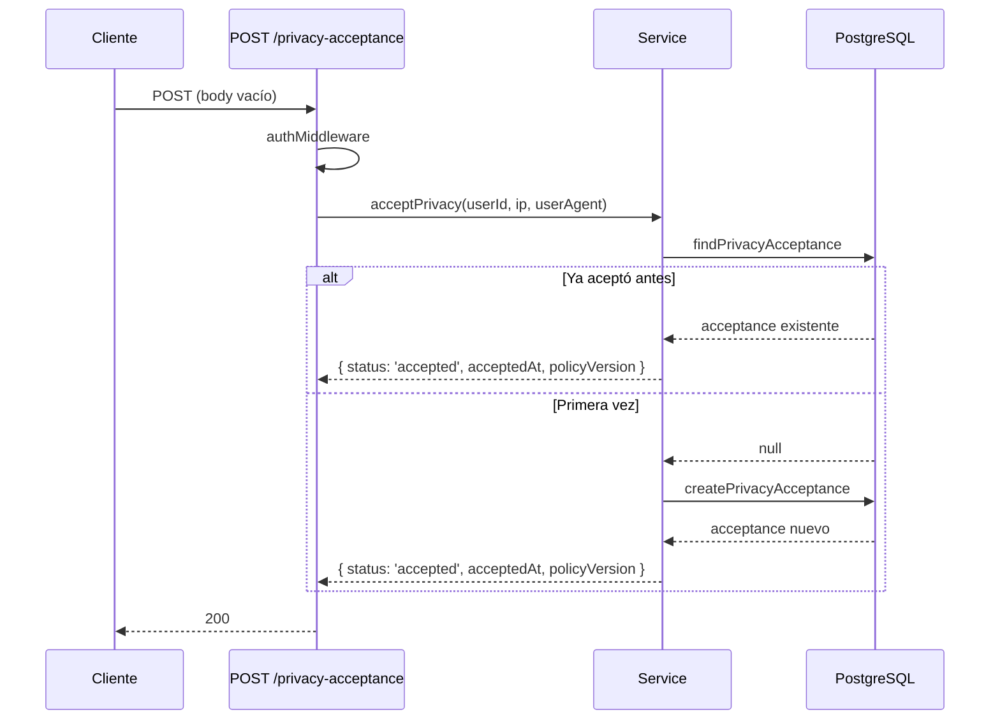
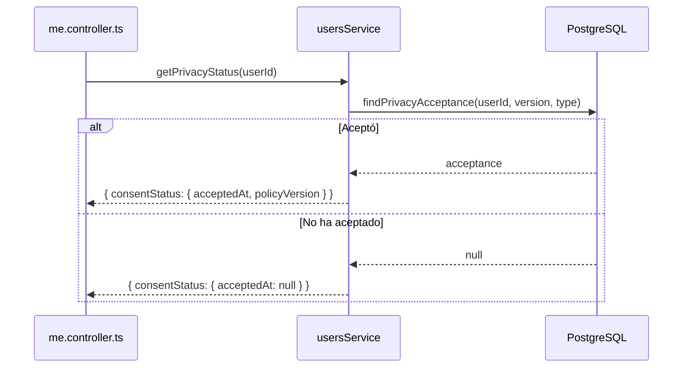
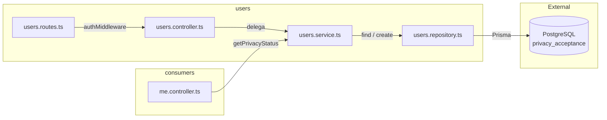

# Módulo Users — Aceptación de Privacidad

Gestión de consentimiento de privacidad (Ley 1581). Montado bajo `/api/users`.
Sirve como **proveedor de servicio** para el módulo `me` (`me.controller.ts` llama a `usersService.getPrivacyStatus`).

## Estructura del Módulo

| Archivo | Capa | Responsabilidad |
|---------|------|----------------|
| `users.routes.ts` | Route | Define endpoints con `authMiddleware` |
| `users.controller.ts` | Controller | Captura IP/User-Agent, delega a service |
| `users.service.ts` | Service | Lógica de aceptación: idempotente (re-aceptar devuelve mismo estado) |
| `users.repository.ts` | Repository | Consultas Prisma sobre tabla `privacy_acceptance` |
| `users.validators.ts` | Validator | Vacío — rutas de privacidad aceptan body crudo |

### Capa Service

| Método | Input | Output | Dependencias |
|--------|-------|--------|-------------|
| `getPrivacyStatus` | userId | `{ consentStatus: { required, acceptedAt, policyVersion } }` | `usersRepo.findPrivacyAcceptance` |
| `acceptPrivacy` | userId, ipAddress, userAgent | `{ status, acceptedAt, policyVersion }` | `usersRepo.findPrivacyAcceptance`, `usersRepo.createPrivacyAcceptance` |

### Capa Repository (Prisma — tabla `privacy_acceptance`)

| Método | Query | Uso |
|--------|-------|-----|
| `findPrivacyAcceptance` | `findFirst` por userId + policyVersion + policyType | Verificar si ya aceptó |
| `createPrivacyAcceptance` | `create` con IP y User-Agent | Registrar aceptación |

## Rutas

| Método | Ruta | Middleware | Descripción |
|--------|------|-----------|-------------|
| POST | `/api/users/me/privacy-acceptance` | `authMiddleware` | Aceptar política de privacidad (idempotente) |
| GET | `/api/users/me/privacy-status` | `authMiddleware` | Estado de aceptación del usuario actual |

## Respuestas

### POST privacy-acceptance — 200
```json
{
  "status": "accepted",
  "acceptedAt": "2026-07-08T12:00:00.000Z",
  "policyVersion": "v1"
}
```

### GET privacy-status — 200
```json
{
  "consentStatus": {
    "required": true,
    "acceptedAt": "2026-07-08T12:00:00.000Z",
    "policyVersion": "v1"
  }
}
```

## Códigos de Error

| Código | Status | Causa |
|--------|--------|-------|
| `UNAUTHORIZED` | 401 | JWT faltante o inválido |

## Flujo: Aceptar Privacidad



## Flujo: GET privacy-status (usado por me)



## Arquitectura del Módulo


