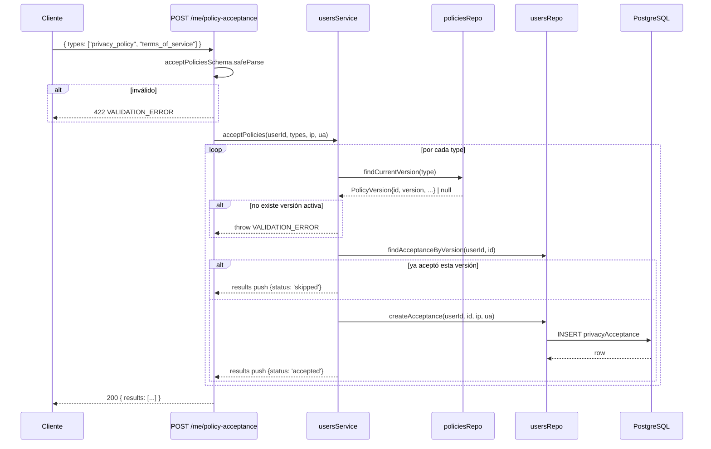
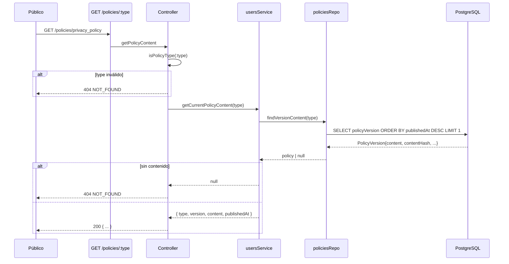
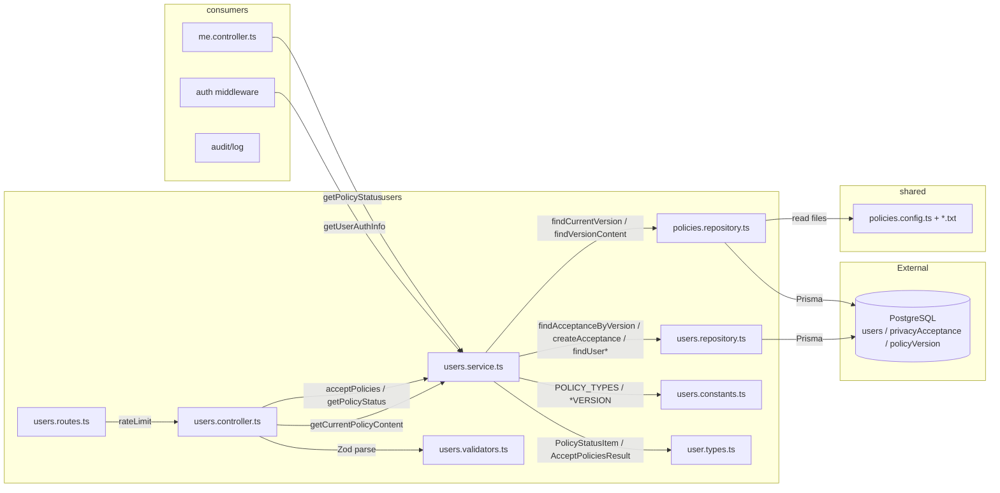

# Módulo Users — Aceptación de Políticas y Contenido Dinámico

Gestión del consentimiento de políticas del usuario y exposición pública del texto vigente (Ley 1581 + términos). Las políticas viven en BD (`policyVersion`) con `content` (texto) y `contentHash` (sha256). El sembrado inicial se hace en boot leyendo archivos de `shared/policies/`.

## Estructura del Módulo

| Archivo | Capa | Responsabilidad |
|---------|------|----------------|
| `users.routes.ts` | Route | 1 ruta pública (`/policies/:type`) + 2 privadas bajo JWT |
| `users.controller.ts` | Controller | 3 handlers: `acceptPolicies`, `getPolicyStatus`, `getPolicyContent` |
| `users.service.ts` | Service | Orquesta `policiesRepo` + `usersRepo`; idempotencia por (`userId`, `policyVersionId`) |
| `users.repository.ts` | Repository | Prisma sobre `privacyAcceptance` (aceptaciones) y `user` (snapshot para auth) |
| `policies.repository.ts` | Repository | Prisma sobre `policyVersion`: versión vigente por tipo, contenido, seed en boot |
| `users.validators.ts` | Validator | Zod: `acceptPoliciesSchema` (`types: enum[]`), `policyTypeParamSchema` |
| `users.constants.ts` | Constants | `POLICY_TYPES` (`privacy_policy` \| `terms_of_service`), versiones default |
| `user.types.ts` | Types | `PolicyStatusItem`, `AcceptPoliciesResult` |

### Capa Service

| Método | Input | Output | Dependencias |
|--------|-------|--------|-------------|
| `getUserAuthInfo` | userId, jwtRole | `{ role, isActive }` \| `null` | `usersRepo.findAuthUser` |
| `getUserSnapshot` | userId | `{ role, fullName, cedula }` \| `null` | `usersRepo.findUserSnapshot` |
| `getPolicyStatus` | userId | `{ policies: PolicyStatusItem[] }` (1 por `POLICY_TYPES`) | `policiesRepo.findCurrentVersion` × N, `usersRepo.findUserAcceptancesByType` |
| `getCurrentPolicyContent` | type | `{ type, version, content, publishedAt }` \| `null` | `policiesRepo.findVersionContent` |
| `acceptPolicies` | userId, types[], ip, ua | `AcceptPoliciesResult` (status `accepted` \| `skipped` por tipo) | `policiesRepo.findCurrentVersion`, `usersRepo.findAcceptanceByVersion`, `usersRepo.createAcceptance` |

### Capa Repository

`users.repository.ts` (Prisma — tablas `privacyAcceptance`, `user`):

| Método | Query | Uso |
|--------|-------|-----|
| `findAuthUser` | `findUnique` por id, select `{ role, isActive }` | Snapshot auth (sin exponer PII) |
| `findUserSnapshot` | `findUnique` por id, select `{ role, fullName, cedula }` | Auditoría / actor log |
| `findUserAcceptancesByType` | `findMany` por userId, join `policyVersion` (id, version, type) | Estado global de políticas aceptadas |
| `findAcceptanceByVersion` | `findUnique` por `userId_policyVersionId` | Idempotencia |
| `createAcceptance` | `create` con ip + ua | Registrar consentimiento (Ley 1581) |

`policies.repository.ts` (Prisma — tabla `policyVersion`):

| Método | Query | Uso |
|--------|-------|-----|
| `findCurrentVersion` | `findFirst` por policyType, `orderBy publishedAt desc` | Versión vigente del tipo |
| `findVersionContent` | `findFirst` por policyType con `content` + `contentHash` | Endpoint público `/policies/:type` |
| `seedAllPolicies` | batch `findUnique` + `create`/`update` por (`type`,`version`) | Lee `shared/policies/*.txt`, compara hash, inserta si no existe o si `contentHash=''` (migración sin poblar) |

### Rutas — Públicas

Sin `authMiddleware`. Aplican rate limit.

| Método | Ruta | Rate Limit | Descripción |
|--------|------|-----------|-------------|
| GET | `/api/users/policies/:type` | `publicRead` | Devuelve `{ type, version, content, publishedAt }` de la versión vigente |

### Rutas — Privadas (JWT)

Aplican `authMiddleware` + rate limit.

| Método | Ruta | Rate Limit | Descripción |
|--------|------|-----------|-------------|
| POST | `/api/users/me/policy-acceptance` | `clientWrite` | Aceptar uno o varios tipos. Body: `{ types: PolicyType[] }`. Devuelve array de resultados |
| GET | `/api/users/me/policy-status` | `client` | Estado por tipo: `{ policies: [{ type, currentVersion, accepted, acceptedAt }] }` |

### Constantes

```ts
POLICY_TYPES = ['privacy_policy', 'terms_of_service'];
PRIVACY_POLICY_VERSION = '1.0.0';
TERMS_OF_SERVICE_VERSION = '1.0.0';
```

Cuando el hash de un archivo cambia vs. el `contentHash` registrado, `seedAllPolicies` loguea error — **no bumpea la versión automáticamente**; hay que incrementar manualmente el const `*_VERSION` y la `version` en el `prisma.policyVersion` (o mediante flujo admin). La nueva versión pasa a ser "vigente" porque `findCurrentVersion` ordena por `publishedAt desc`.

## Respuestas

### POST `/me/policy-acceptance` — 200

```json
{
  "results": [
    { "type": "privacy_policy", "version": "1.0.0", "status": "accepted", "acceptedAt": "2026-08-13T12:00:00.000Z" },
    { "type": "terms_of_service", "version": "1.0.0", "status": "skipped", "acceptedAt": "2026-08-10T08:00:00.000Z" }
  ]
}
```

- `status: 'accepted'` → nueva fila creada en `privacyAcceptance`.
- `status: 'skipped'` → ya existía aceptación para esa `policyVersionId` (idempotencia).
- Si el usuario ya tenía una versión anterior aceptada y la nueva aún no la aceptó, **no se marca aceptada retroactivamente**: el cliente debe reenviar el POST con la versión actual.

### GET `/me/policy-status` — 200

```json
{
  "policies": [
    { "type": "privacy_policy",  "currentVersion": "1.0.0", "accepted": true,  "acceptedAt": "2026-08-13T12:00:00.000Z" },
    { "type": "terms_of_service", "currentVersion": "1.0.0", "accepted": false, "acceptedAt": null }
  ]
}
```

### GET `/policies/:type` — 200

```json
{
  "type": "privacy_policy",
  "version": "1.0.0",
  "content": "Texto completo de la política...",
  "publishedAt": "2026-08-13T00:00:00.000Z"
}
```

## Códigos de Error

| Código | Status | Capa | Causa |
|--------|--------|------|-------|
| `VALIDATION_ERROR` | 422 | Controller / Service | Body sin `types`, `types` vacío, tipo desconocido, sin versión activa |
| `NOT_FOUND` | 404 | Controller | `:type` fuera de `POLICY_TYPES` o sin versión activa |
| `UNAUTHORIZED` | 401 | Middleware | JWT faltante o inválido (rutas `/me/*`) |

## Reglas de Negocio

- `acceptPolicies` es **idempotente** por (`userId`, `policyVersionId`): reenviar no duplica, devuelve `skipped`.
- Cada aceptación persiste IP + User-Agent del aceptante (traza de consentimiento — Ley 1581).
- El `content` de la política se sirve desde BD (no desde filesystem en request), pero se siembra en boot desde los `.txt` en `shared/policies/`.
- Una nueva versión publicada invalida aceptaciones previas: el cliente debe re-aceptar.

## Flujo: Aceptar Múltiples Políticas


```mermaid
sequenceDiagram
    participant C as Cliente
    participant API as POST /me/policy-acceptance
    participant S as usersService
    participant PR as policiesRepo
    participant UR as usersRepo
    participant DB as PostgreSQL

    C->>API: { types: ["privacy_policy", "terms_of_service"] }
    API->>API: acceptPoliciesSchema.safeParse
    alt inválido
        API-->>C: 422 VALIDATION_ERROR
    end
    API->>S: acceptPolicies(userId, types, ip, ua)
    loop por cada type
        S->>PR: findCurrentVersion(type)
        PR-->>S: PolicyVersion{id, version, ...} | null
        alt no existe versión activa
            S-->>API: throw VALIDATION_ERROR
        end
        S->>UR: findAcceptanceByVersion(userId, id)
        alt ya aceptó esta versión
            S-->>API: results push {status: 'skipped'}
        else
            S->>UR: createAcceptance(userId, id, ip, ua)
            UR->>DB: INSERT privacyAcceptance
            DB-->>UR: row
            S-->>API: results push {status: 'accepted'}
        end
    end
    API-->>C: 200 { results: [...] }
```

## Flujo: GET `/policies/:type`


```mermaid
sequenceDiagram
    participant P as Público
    participant API as GET /policies/:type
    participant C as Controller
    participant S as usersService
    participant PR as policiesRepo
    participant DB as PostgreSQL

    P->>API: GET /policies/privacy_policy
    API->>C: getPolicyContent
    C->>C: isPolicyType(:type)
    alt type inválido
        C-->>P: 404 NOT_FOUND
    end
    C->>S: getCurrentPolicyContent(type)
    S->>PR: findVersionContent(type)
    PR->>DB: SELECT policyVersion ORDER BY publishedAt DESC LIMIT 1
    DB-->>PR: PolicyVersion{content, contentHash, ...}
    PR-->>S: policy | null
    alt sin contenido
        S-->>C: null
        C-->>P: 404 NOT_FOUND
    else
        S-->>C: { type, version, content, publishedAt }
        C-->>P: 200 { ... }
    end
```

## Arquitectura del Módulo


```mermaid
graph LR
    subgraph users
        R[users.routes.ts]
        C[users.controller.ts]
        S[users.service.ts]
        UR[users.repository.ts]
        PR[policies.repository.ts]
        V[users.validators.ts]
        K[users.constants.ts]
        T[user.types.ts]
    end
    subgraph shared
        PC[policies.config.ts + *.txt]
    end
    subgraph consumers
        ME[me.controller.ts]
        AUTH[auth middleware]
        AUD[audit/log]
    end
    subgraph External
        DB[(PostgreSQL<br/>users / privacyAcceptance / policyVersion)]
    end

    R -->|rateLimit| C
    C -->|acceptPolicies / getPolicyStatus| S
    C -->|getCurrentPolicyContent| S
    S -->|findCurrentVersion / findVersionContent| PR
    S -->|findAcceptanceByVersion / createAcceptance / findUser*| UR
    C -->|Zod parse| V
    S -->|POLICY_TYPES / *VERSION| K
    S -->|PolicyStatusItem / AcceptPoliciesResult| T
    ME -->|getPolicyStatus| S
    AUTH -->|getUserAuthInfo| S
    PR -->|read files| PC
    PR -->|Prisma| DB
    UR -->|Prisma| DB
```
