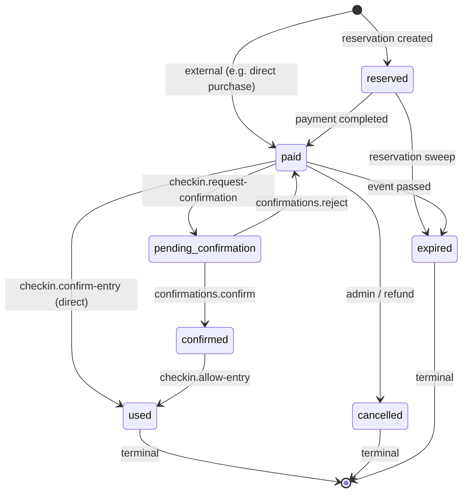

# Ticket Lifecycle

State machine for the `tickets.status` enum.

## States

| State | Meaning | Set by |
|---|---|---|
| `reserved` | Reserved during checkout, not yet paid | payment reservation |
| `paid` | Purchased, valid for entry | payment completion |
| `pending_confirmation` | Awaiting buyer's remote authorization | checkin request-confirmation |
| `confirmed` | Buyer authorized entry remotely | confirmations confirm |
| `used` | Already entered | checkin confirm-entry / allow-entry |
| `cancelled` | Cancelled / refunded | admin / payment failure |
| `expired` | Past event, not used | sweep / event passed |

## Transitions

## Transition rules

Every state change goes through a single endpoint that:

1. Opens a Postgres transaction
2. Takes a row-level lock (`SELECT ... FOR UPDATE`)
3. Verifies the current status matches the expected `from` state
4. Issues `UPDATE tickets SET status = X WHERE id = Y AND status = Z`
5. Maps `affected_rows = 0` to `TICKET_NOT_AVAILABLE` (HTTP 409)

This pattern is race-safe: two concurrent checkers processing the same ticket both pass step 3, but only the first wins at step 4. The second sees `affected_rows = 0` and gets 409.

## Check-in module's interaction with the lifecycle

The `checkin` module owns the following transitions:

| Transition | Endpoint | Auth |
|---|---|---|
| `paid → used` | `POST /internal/checkin/confirm-entry` | session (checker/admin) |
| `paid → pending_confirmation` | `POST /internal/checkin/request-confirmation` | session (checker/admin) |
| `confirmed → used` | `POST /internal/checkin/allow-entry` | session (checker/admin) |

The `confirmations` module owns:

| Transition | Endpoint | Auth |
|---|---|---|
| `pending_confirmation → confirmed` | `POST /confirmations/confirm` | confirmation token |
| `pending_confirmation → paid` | `POST /confirmations/reject` | confirmation token |

External (non-checkin) transitions (`paid → cancelled`, `paid → expired`, etc.) are managed by the `payments` module and admin tooling, not by the check-in flow.
