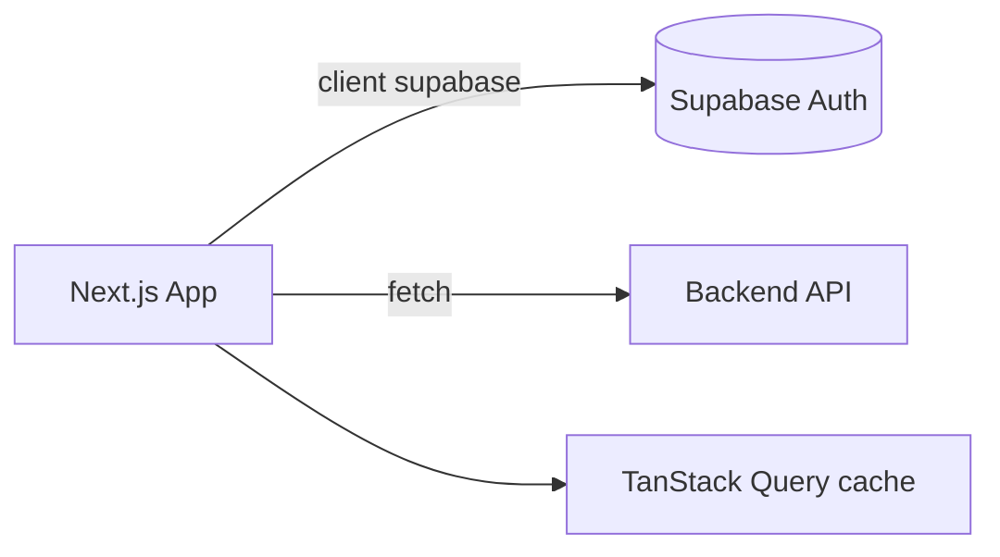

# Frontend — App Web de Entradas

Aplicación web La U. Next.js (App Router) + TypeScript + Chakra UI + TanStack Query. Lógica de negocio en `features/<dominio>/`; `app/` solo rutas y layouts.

## Stack

| Área | Tecnología |
|------|-----------|
| Framework | Next.js 16 (App Router) + React 19 |
| UI | Chakra UI 3 + Tailwind 4 + Framer Motion |
| Server state | TanStack Query 5 |
| Auth/Supabase | `@supabase/ssr` (cliente server/browser separados) |
| Validación | Zod |
| Pagos | `@mercadopago/sdk-react` |
| Gráficos | Recharts |
| QR | `qr-scanner` (escaneo), `qrcode.react` (render) |
| Iconos | Tabler Icons |
| Toasts | Sonner |
| Importar Excel | `read-excel-file` |
| Tests | Vitest + Testing Library + jsdom |

## Estructura

```
app/          → rutas y layouts únicamente (sin fetching ni lógica)
features/     → lógica por dominio: components/ hooks/ api/ schemas/ types/
shared/       → infraestructura transversal: UI genérica, clients supabase, theme, utils
components/   → layout y ui compartidos
providers/    → contextos app-wide: QueryProvider, AuthProvider, CartProvider
middleware.ts → protección de rutas (mi-cuenta/*, admin/*)
```

### Features

`landing` · `auth` · `users` · `entradas` (tickets) · `ticket-purchase` · `ticket-types` · `payments` · `donaciones` · `confirmations` · `checkin` · `agenda` · `sponsor` · `audit` · `admin-analytics` · `admin-auth` · `admin-donations` · `admin-payments` · `admin-tickets` · `admin-users`

## Instalación

```bash
cd frontend
pnpm install
cp .env.local.example .env.local   # llenar credenciales
pnpm dev
```

## Comandos

| Comando | Descripción |
|---------|-------------|
| `pnpm dev` | Servidor de desarrollo Next.js → http://localhost:3000 |
| `pnpm build` | Build de producción |
| `pnpm start` | Servir build de producción |
| `pnpm test` | Tests (Vitest) |
| `pnpm test:watch` | Tests en modo watch |
| `pnpm lint` | ESLint |

## Convenciones de Datos

- Los componentes llaman a los api clients (`features/*/api/*.client.ts`) — nunca `supabase.auth.*`/`fetch` directo en un componente.
- **TanStack Query** para el server state; sin `useEffect` manual de fetching.
- Validación **Zod** de todos los formularios antes de enviar.
- Cliente Supabase por lado: server en Server Components / Route Handlers / `middleware.ts`; browser solo en Client Components.
- `app/` no contiene fetching ni lógica de negocio.

## Arquitectura


