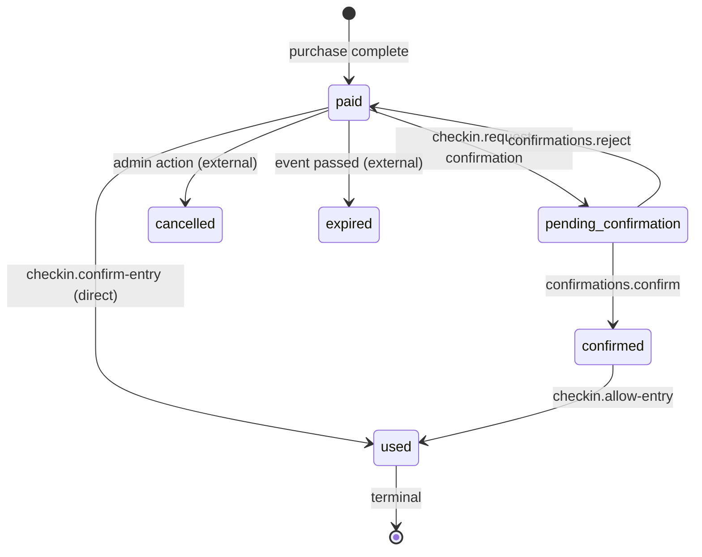

# Data Model — Check-in and Remote Confirmation

**Date**: 2026-07-20

## Entities

No new database tables. All data lives in existing `tickets` table and uses existing columns.

### Ticket (existing entity)

**Relevant fields**:

| Field | Type | Purpose |
|-------|------|---------|
| `id` | UUID | Primary key |
| `status` | `TicketStatus` enum | Current lifecycle state |
| `checked_in_at` | `TIMESTAMPTZ?` | When ticket was marked as `used` |
| `event_id` | UUID | FK to events (for event name display) |
| `buyer_id` | UUID | FK to users (for buyer contact on confirmation request) |
| `attendee_name` | text | Name displayed to checker |
| `qr_token` | text | Encoded JWT for QR scan |

### TicketStatus enum (existing, extended)

Relevant values for this feature:

| Value | Meaning | Checker-visible? | Actionable? |
|-------|---------|-----------------|-------------|
| `paid` | Ticket purchased, valid for entry | Yes | confirm_entry / request_confirmation |
| `pending_confirmation` | Awaiting buyer response | Yes | No |
| `confirmed` | Buyer authorized entry remotely | Yes | allow_entry |
| `used` | Already entered | Yes (info only) | No |
| `reserved` | Reserved, not paid | Yes (info only) | No |
| `cancelled` | Cancelled / refunded | Yes (info only) | No |
| `expired` | Past event, not used | Yes (info only) | No |

## State Transition Diagram



## Check-in Record (conceptual)

The `checked_in_at` timestamp on `tickets` + `checker_id` (the admin who processed) is sufficient for tracking. No separate check-in log table needed for v1.

```ts
// Conceptual shape — captured via existing fields
type CheckInRecord = {
  ticketId: string;
  eventName: string;
  attendeeName: string;
  checkedInAt: Date;
  processedBy: string; // checker admin ID
};
```

## Validation Rules

| Field | Rule |
|-------|------|
| `qrToken` | Required, non-empty string, valid JWT |
| `ticketId` | Required, valid UUID |
| `token` (confirmation) | Required, non-empty string, valid JWT with purpose='confirm' |

## State Transition Rules

| Transition | Lock pattern | Rollback condition |
|-----------|-------------|-------------------|
| `paid → used` | `SELECT ... FOR UPDATE` + `UPDATE WHERE status = 'paid'` | affectedRows === 0 → 409 |
| `paid → pending_confirmation` | `SELECT ... FOR UPDATE` + `UPDATE WHERE status = 'paid'` | affectedRows === 0 → 409 |
| `pending_confirmation → confirmed` | `SELECT ... FOR UPDATE` + `UPDATE WHERE status = 'pending_confirmation'` | affectedRows === 0 → 409 |
| `pending_confirmation → paid` | `SELECT ... FOR UPDATE` + `UPDATE WHERE status = 'pending_confirmation'` | affectedRows === 0 → 409 |
| `confirmed → used` | `SELECT ... FOR UPDATE` + `UPDATE WHERE status = 'confirmed'` | affectedRows === 0 → 409 |
